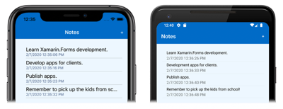
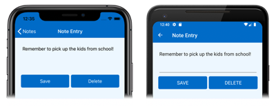

# Style a Cross-Platform Xamarin.Forms Application

[ Download the sample](/samples/xamarin/xamarin-forms-samples/getstarted-notes-styled/)

In this quickstart, you will learn how to:

- Style a Xamarin.Forms application using XAML styles.

The quickstart walks through how to style a cross-platform Xamarin.Forms application with XAML styles. The final application is shown below:

[](styling-images/screenshots1.png#lightbox "Notes Page")
[](styling-images/screenshots2.png#lightbox "Note Entry Page")

### Prerequisites

You should successfully complete the [previous quickstart](database.md) before attempting this quickstart. Alternatively, download the [previous quickstart sample](/samples/xamarin/xamarin-forms-samples/getstarted-notes-database/) and use it as the starting point for this quickstart.

::: zone pivot="windows"

## Update the app with Visual Studio

1. Launch Visual Studio and open the Notes solution.

2. In **Solution Explorer**, in the **Notes** project, double-click **App.xaml** to open it. Then replace the existing code with the following code:

    ```xaml
    <?xml version="1.0" encoding="utf-8"?>
    <Application xmlns="http://xamarin.com/schemas/2014/forms"
                 xmlns:x="http://schemas.microsoft.com/winfx/2009/xaml"
                 x:Class="Notes.App">
        <Application.Resources>

            <Thickness x:Key="PageMargin">20</Thickness>

            <!-- Colors -->
            <Color x:Key="AppBackgroundColor">AliceBlue</Color>
            <Color x:Key="NavigationBarColor">#1976D2</Color>
            <Color x:Key="NavigationBarTextColor">White</Color>

            <!-- Implicit styles -->
            <Style TargetType="{x:Type NavigationPage}">
                <Setter Property="BarBackgroundColor"
                        Value="{StaticResource NavigationBarColor}" />
                 <Setter Property="BarTextColor"
                        Value="{StaticResource NavigationBarTextColor}" />           
            </Style>

            <Style TargetType="{x:Type ContentPage}"
                   ApplyToDerivedTypes="True">
                <Setter Property="BackgroundColor"
                        Value="{StaticResource AppBackgroundColor}" />
            </Style>

        </Application.Resources>
    </Application>
    ```

    This code defines a [`Thickness`](xref:Xamarin.Forms.Thickness) value, a series of [`Color`](xref:Xamarin.Forms.Color) values, and implicit styles for the [`NavigationPage`](xref:Xamarin.Forms.NavigationPage) and [`ContentPage`](xref:Xamarin.Forms.ContentPage). Note that these styles, which are in the application-level [`ResourceDictionary`](xref:Xamarin.Forms.ResourceDictionary), can be consumed throughout the application. For more information about XAML styling, see [Styling](deepdive.md#styling) in the [Xamarin.Forms Quickstart Deep Dive](deepdive.md).

    Save the changes to **App.xaml** by pressing **CTRL+S**, and close the file.

3. In **Solution Explorer**, in the **Notes** project, double-click **NotesPage.xaml** to open it. Then replace the existing code with the following code:

    ```xaml
    <?xml version="1.0" encoding="UTF-8"?>
    <ContentPage xmlns="http://xamarin.com/schemas/2014/forms"
                 xmlns:x="http://schemas.microsoft.com/winfx/2009/xaml"
                 x:Class="Notes.NotesPage"
                 Title="Notes">
        <ContentPage.Resources>
            <!-- Implicit styles -->
            <Style TargetType="{x:Type ListView}">
                <Setter Property="BackgroundColor"
                        Value="{StaticResource AppBackgroundColor}" />
            </Style>
        </ContentPage.Resources>

        <ContentPage.ToolbarItems>
            <ToolbarItem Text="+"
                         Clicked="OnNoteAddedClicked" />
        </ContentPage.ToolbarItems>

        <ListView x:Name="listView"
                  Margin="{StaticResource PageMargin}"
                  ItemSelected="OnListViewItemSelected">
            <ListView.ItemTemplate>
                <DataTemplate>
                    <TextCell Text="{Binding Text}"
                              TextColor="Black"
                              Detail="{Binding Date}" />
                </DataTemplate>
            </ListView.ItemTemplate>
        </ListView>

    </ContentPage>
    ```

    This code adds an implicit style for the [`ListView`](xref:Xamarin.Forms.ListView) to the page-level [`ResourceDictionary`](xref:Xamarin.Forms.ResourceDictionary), and sets the `ListView.Margin` property to a value defined in the application-level `ResourceDictionary`. Note that the `ListView` implicit style was added to the page-level `ResourceDictionary`, because it is only consumed by the `NotesPage`. For more information about XAML styling, see [Styling](deepdive.md#styling) in the [Xamarin.Forms Quickstart Deep Dive](deepdive.md).

    Save the changes to **NotesPage.xaml** by pressing **CTRL+S**, and close the file.

4. In **Solution Explorer**, in the **Notes** project, double-click **NoteEntryPage.xaml** to open it. Then replace the existing code with the following code:

    ```xaml
    <?xml version="1.0" encoding="UTF-8"?>
    <ContentPage xmlns="http://xamarin.com/schemas/2014/forms"
                 xmlns:x="http://schemas.microsoft.com/winfx/2009/xaml"
                 x:Class="Notes.NoteEntryPage"
                 Title="Note Entry">
        <ContentPage.Resources>
            <!-- Implicit styles -->
            <Style TargetType="{x:Type Editor}">
                <Setter Property="BackgroundColor"
                        Value="{StaticResource AppBackgroundColor}" />
            </Style>

            <Style TargetType="Button"
                   ApplyToDerivedTypes="True"
                   CanCascade="True">
                <Setter Property="FontSize" Value="Medium" />
                <Setter Property="BackgroundColor" Value="#1976D2" />
                <Setter Property="TextColor" Value="White" />
                <Setter Property="CornerRadius" Value="5" />
            </Style>
        </ContentPage.Resources>

        <StackLayout Margin="{StaticResource PageMargin}">
            <Editor Placeholder="Enter your note"
                    Text="{Binding Text}"
                    HeightRequest="100" />
            <Grid>
                <Grid.ColumnDefinitions>
                    <ColumnDefinition Width="*" />
                    <ColumnDefinition Width="*" />
                </Grid.ColumnDefinitions>
                <Button Text="Save"
                        Clicked="OnSaveButtonClicked" />
                <Button Grid.Column="1"
                        Text="Delete"
                        Clicked="OnDeleteButtonClicked" />
            </Grid>
        </StackLayout>

    </ContentPage>
    ```

    This code adds implicit styles for the [`Editor`](xref:Xamarin.Forms.Editor) and [`Button`](xref:Xamarin.Forms.Button) views to the page-level [`ResourceDictionary`](xref:Xamarin.Forms.ResourceDictionary), and sets the `StackLayout.Margin` property to a value defined in the application-level `ResourceDictionary`. Note that the `Editor` and `Button` implicit styles were added to the page-level `ResourceDictionary`, because they are only consumed by the `NoteEntryPage`. For more information about XAML styling, see [Styling](deepdive.md#styling) in the [Xamarin.Forms Quickstart Deep Dive](deepdive.md).

    Save the changes to **NoteEntryPage.xaml** by pressing **CTRL+S**, and close the file.

5. Build and run the project on each platform. For more information, see [Building the quickstart](single-page.md#building-the-quickstart).

    On the **NotesPage** press the **+** button to navigate to the **NoteEntryPage** and enter a note. On each page, observe how the styling has changed from the previous quickstart.

::: zone-end
::: zone pivot="macos"

## Update the app with Visual Studio for Mac

1. Launch Visual Studio for Mac and open the Notes project.

2. In the **Solution Pad**, in the **Notes** project, double-click **App.xaml** to open it. Then replace the existing code with the following code:

    ```xaml
    <?xml version="1.0" encoding="utf-8"?>
    <Application xmlns="http://xamarin.com/schemas/2014/forms"
                 xmlns:x="http://schemas.microsoft.com/winfx/2009/xaml"
                 x:Class="Notes.App">
        <Application.Resources>

            <Thickness x:Key="PageMargin">20</Thickness>

            <!-- Colors -->
            <Color x:Key="AppBackgroundColor">AliceBlue</Color>
            <Color x:Key="NavigationBarColor">#1976D2</Color>
            <Color x:Key="NavigationBarTextColor">White</Color>

            <!-- Implicit styles -->
            <Style TargetType="{x:Type NavigationPage}">
                <Setter Property="BarBackgroundColor"
                        Value="{StaticResource NavigationBarColor}" />
                 <Setter Property="BarTextColor"
                        Value="{StaticResource NavigationBarTextColor}" />           
            </Style>

            <Style TargetType="{x:Type ContentPage}"
                   ApplyToDerivedTypes="True">
                <Setter Property="BackgroundColor"
                        Value="{StaticResource AppBackgroundColor}" />
            </Style>

        </Application.Resources>
    </Application>
    ```

    This code defines a [`Thickness`](xref:Xamarin.Forms.Thickness) value, a series of [`Color`](xref:Xamarin.Forms.Color) values, and implicit styles for the [`NavigationPage`](xref:Xamarin.Forms.NavigationPage) and [`ContentPage`](xref:Xamarin.Forms.ContentPage). Note that these styles, which are in the application-level [`ResourceDictionary`](xref:Xamarin.Forms.ResourceDictionary), can be consumed throughout the application. For more information about XAML styling, see [Styling](deepdive.md#styling) in the [Xamarin.Forms Quickstart Deep Dive](deepdive.md).

    Save the changes to **App.xaml** by choosing **File > Save** (or by pressing **&#8984; + S**), and close the file.

3. In the **Solution Pad**, in the **Notes** project, double-click **NotesPage.xaml** to open it. Then replace the existing code with the following code:

    ```xaml
    <?xml version="1.0" encoding="UTF-8"?>
    <ContentPage xmlns="http://xamarin.com/schemas/2014/forms"
                 xmlns:x="http://schemas.microsoft.com/winfx/2009/xaml"
                 x:Class="Notes.NotesPage"
                 Title="Notes">
        <ContentPage.Resources>
            <!-- Implicit styles -->
            <Style TargetType="{x:Type ListView}">
                <Setter Property="BackgroundColor"
                        Value="{StaticResource AppBackgroundColor}" />
            </Style>
        </ContentPage.Resources>

        <ContentPage.ToolbarItems>
            <ToolbarItem Text="+"
                         Clicked="OnNoteAddedClicked" />
        </ContentPage.ToolbarItems>

        <ListView x:Name="listView"
                  Margin="{StaticResource PageMargin}"
                  ItemSelected="OnListViewItemSelected">
            <ListView.ItemTemplate>
                <DataTemplate>
                    <TextCell Text="{Binding Text}"
                              TextColor="Black"
                              Detail="{Binding Date}" />
                </DataTemplate>
            </ListView.ItemTemplate>
        </ListView>

    </ContentPage>
    ```

    This code adds an implicit style for the [`ListView`](xref:Xamarin.Forms.ListView) to the page-level [`ResourceDictionary`](xref:Xamarin.Forms.ResourceDictionary), and sets the `ListView.Margin` property to a value defined in the application-level `ResourceDictionary`. Note that the `ListView` implicit style was added to the page-level `ResourceDictionary`, because it is only consumed by the `NotesPage`. For more information about XAML styling, see [Styling](deepdive.md#styling) in the [Xamarin.Forms Quickstart Deep Dive](deepdive.md).

    Save the changes to **NotesPage.xaml** by choosing **File > Save** (or by pressing **&#8984; + S**), and close the file.

4. In the **Solution Pad**, in the **Notes** project, double-click **NoteEntryPage.xaml** to open it. Then replace the existing code with the following code:

    ```xaml
    <?xml version="1.0" encoding="UTF-8"?>
    <ContentPage xmlns="http://xamarin.com/schemas/2014/forms"
                 xmlns:x="http://schemas.microsoft.com/winfx/2009/xaml"
                 x:Class="Notes.NoteEntryPage"
                 Title="Note Entry">
        <ContentPage.Resources>
            <!-- Implicit styles -->
            <Style TargetType="{x:Type Editor}">
                <Setter Property="BackgroundColor"
                        Value="{StaticResource AppBackgroundColor}" />
            </Style>

            <Style TargetType="Button"
                   ApplyToDerivedTypes="True"
                   CanCascade="True">
                <Setter Property="FontSize" Value="Medium" />
                <Setter Property="BackgroundColor" Value="#1976D2" />
                <Setter Property="TextColor" Value="White" />
                <Setter Property="CornerRadius" Value="5" />
            </Style>
        </ContentPage.Resources>

        <StackLayout Margin="{StaticResource PageMargin}">
            <Editor Placeholder="Enter your note"
                    Text="{Binding Text}"
                    HeightRequest="100" />
            <Grid>
                <Grid.ColumnDefinitions>
                    <ColumnDefinition Width="*" />
                    <ColumnDefinition Width="*" />
                </Grid.ColumnDefinitions>
                <Button Text="Save"
                        Clicked="OnSaveButtonClicked" />
                <Button Grid.Column="1"
                        Text="Delete"
                        Clicked="OnDeleteButtonClicked" />
            </Grid>
        </StackLayout>

    </ContentPage>
    ```

    This code adds implicit styles for the [`Editor`](xref:Xamarin.Forms.Editor) and [`Button`](xref:Xamarin.Forms.Button) views to the page-level [`ResourceDictionary`](xref:Xamarin.Forms.ResourceDictionary), and sets the `StackLayout.Margin` property to a value defined in the application-level `ResourceDictionary`. Note that the `Editor` and `Button` implicit styles were added to the page-level `ResourceDictionary`, because they are only consumed by the `NoteEntryPage`. For more information about XAML styling, see [Styling](deepdive.md#styling) in the [Xamarin.Forms Quickstart Deep Dive](deepdive.md).

    Save the changes to **NoteEntryPage.xaml** by choosing **File > Save** (or by pressing **&#8984; + S**), and close the file.

5. Build and run the project on each platform. For more information, see [Building the quickstart](single-page.md#building-the-quickstart).

    On the **NotesPage** press the **+** button to navigate to the **NoteEntryPage** and enter a note. On each page, observe how the styling has changed from the previous quickstart.

::: zone-end

## Next steps

In this quickstart, you learned how to:

- Style a Xamarin.Forms application using XAML styles.

To learn more about the fundamentals of application development using Xamarin.Forms, continue to the quickstart deep dive.

> [!div class="nextstepaction"]
> [Next](deepdive.md)

## Related links

- [Notes (sample)](/samples/xamarin/xamarin-forms-samples/getstarted-notes-styled/)
- [Xamarin.Forms Quickstart Deep Dive](deepdive.md)