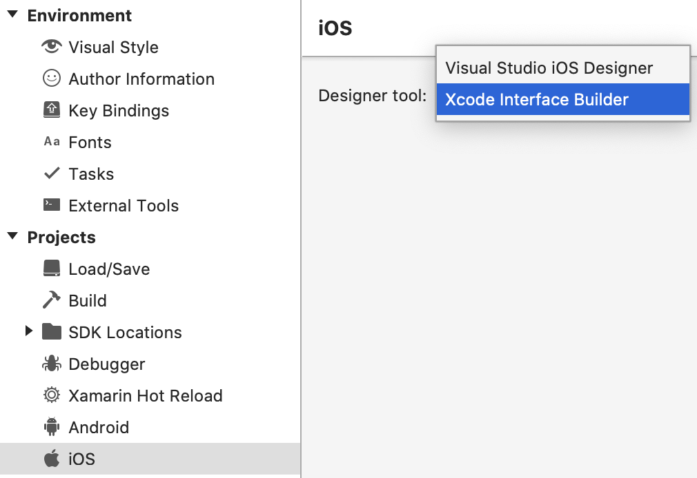
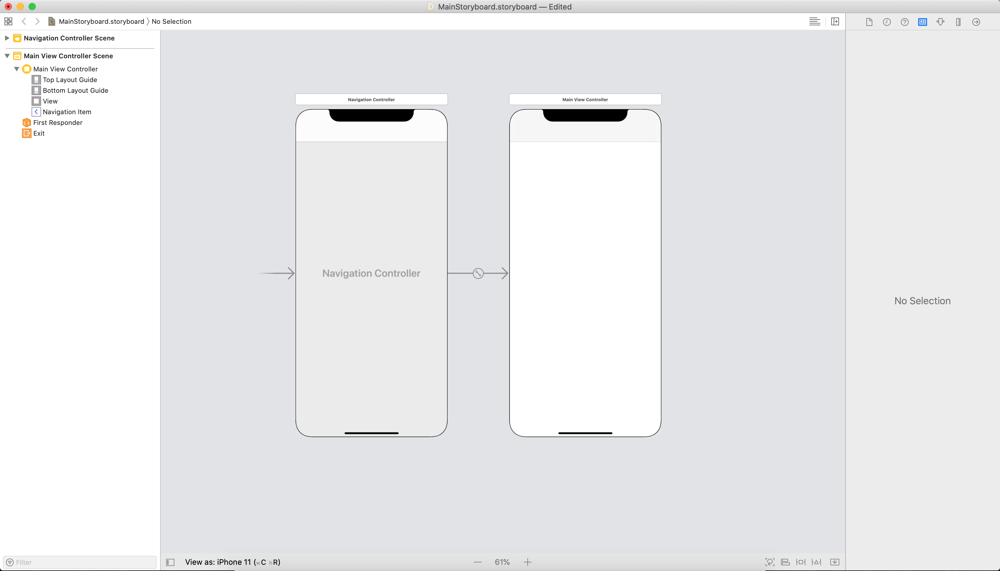
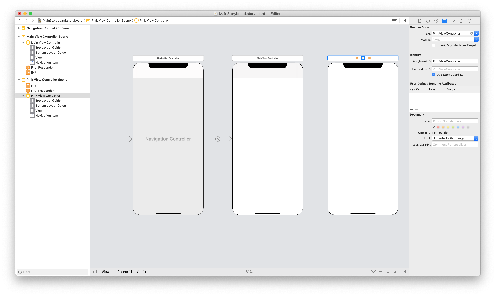
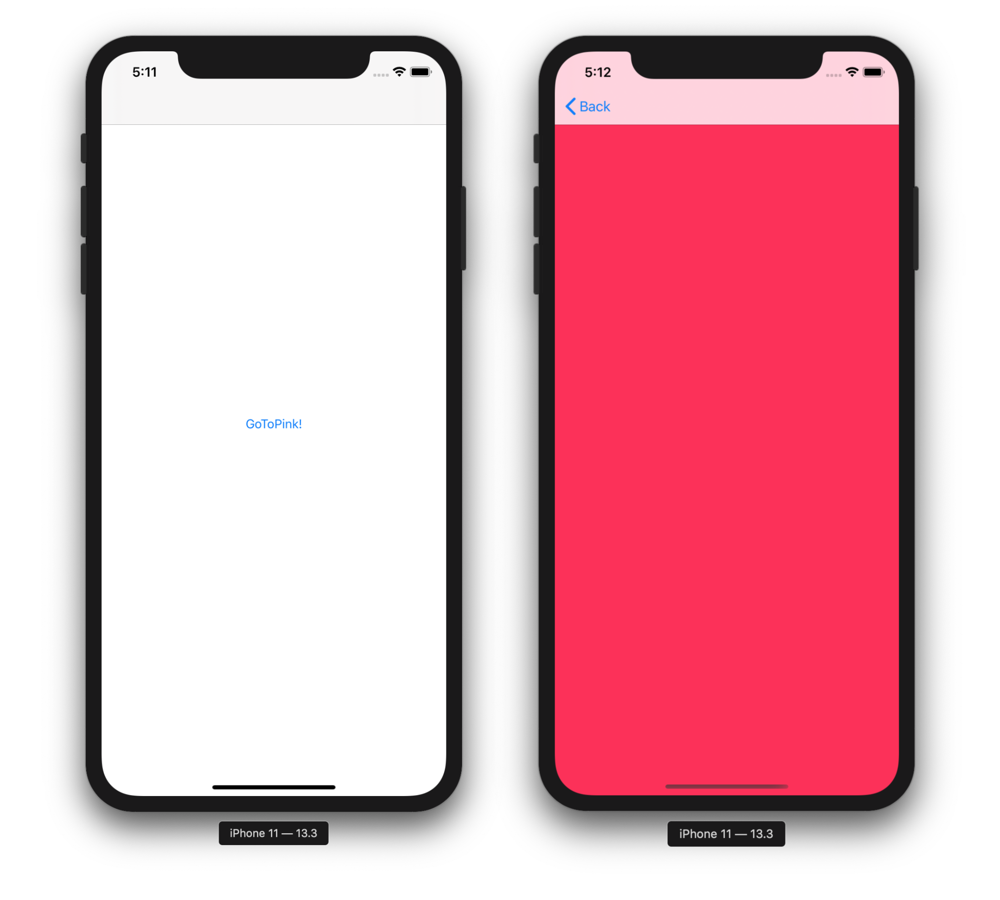
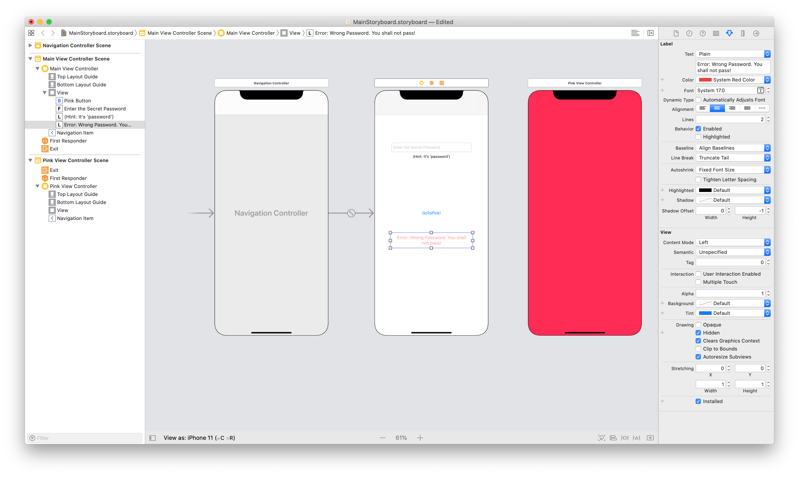

# Storyboards in Xamarin.iOS

In this guide, we will explain what a Storyboard is and examine some of the key components, such as Segues. We'll look at how
Storyboards can be created and used, and what advantages they  have for a developer.

Before the Storyboard file format was introduced by Apple as a visual representation of the UI of an iOS application, developers
created XIB files for each view controller, and programmed the navigation between each view manually.  Using a Storyboard
lets the developer define both view controllers and the navigation between them on a design surface and offers WYSIWYG editing
of the application's user interface.

A Storyboard can be created and opened with Visual Studio for Mac. This guide will also walk through how to use the
Xcode Interface Builder to create your storyboards while using C# to program the navigation.

## Requirements

Storyboards can be used with Xcode and launched from within a Xamarin.iOS project on Visual Studio for Mac.

## What is a Storyboard?

A Storyboard is the visual representation of all the screens in an application. It contains a sequence of scenes, with each
scene representing a *View Controller* and its *Views*. These views may contain objects and
[controls](~/ios/user-interface/controls/index.md) that allow your user to interact with your application. This collection
of views and controls (or *subviews*) is known as a *Content View Hierarchy*. Scenes are connected by segue objects, which
represent a transition between view controllers. This is normally achieved by creating a segue between an object on the
initial view and the connecting view. The relationships on the design surface are illustrated in the following image:

 [](images/storyboardsview.png#lightbox)

As shown, the storyboard lays out each of your scenes with content already rendered and illustrates the connections
between them. When we talk about scenes on an iPhone, it is safe to assume that
one *scene* on the storyboard is equal to one *screen* of content on the device. However, with an iPad, it is possible to have multiple scenes appear at once, for example, using a Popover view controller.

There are many advantages to using storyboards to create your application's UI, especially when using Xamarin. Firstly,
it is a visual representation of the UI, as all objects –
including [custom controls](../designer/ios-designable-controls-overview.md) – are rendered at design time.
This means that before building or deploying your application, you can visualize its appearance and flow. Take the previous
image, for example. We can tell from a quick look at the design surface how many Scenes there are, the layout of each view, 
and how everything is related. This is what makes Storyboards so powerful.

You can also manage events with Storyboards.  Most UI controls have a list of possible events in the Properties Pad. The event handler can be added here and completed in a partial method in the View Controllers class.

The content of a storyboard is stored as an XML file. At build time, any `.storyboard` files are compiled into binary files
known as nibs. At run time, these nibs are initialized and instantiated to create new views.

## Segues

A *Segue*, or *Segue Object*, is used in iOS development to represent a transition between scenes. To create a segue, hold
down the **Ctrl** key and click-drag from one scene to another. As you drag the mouse, a blue connector appears that indicates where the segue will lead. This is shown in the following image:

 [](images/createsegue.png#lightbox)

On mouse-up, a menu appears that lets you choose the action for the segue. It may look similar to the following images:

**Pre-iOS 8 and Size Classes**:

[](images/segue1.png#lightbox)

**When using Size Classes and Adaptive Segues**:

[](images/16new.png#lightbox)

> [!IMPORTANT]
> If you are using VMWare for your Windows Virtual Machine,  Ctrl-click is mapped as the _right-click_ mouse button by default. To create a Segue, edit your Keyboard preferences through **Preferences** > **Keyboard & Mouse** > **Mouse Shortcuts** and remap your **Secondary button** as illustrated below:
>
> [](images/image22.png#lightbox)
>
> You should now be able to add a segue between your view controllers as normal.

There are different types of transitions, each giving control over how a new view controller is presented to the user and how
it interacts with other view controllers in the Storyboard. These are explained below. It is also possible to subclass a segue
object to implement a custom transition:

- **Show / Push** – A push segue adds the view controller to the navigation stack. It assumes the view controller originating the
push is part of the same navigation controller as the view controller that is being added to the stack. This does the same
thing as  `pushViewController` , and is generally used when there is some relationship between the data on the screens. Using the
push segue gives you the luxury of having a navigation bar with a back button and title added to each view on the stack, allowing
drill down navigation through the view hierarchy.
- **Modal** – A modal segue create a relationship between any two view controllers in your project, with the option of showing an
animated transition. The child view controller will completely obscure the parent view controller when brought into
view. Unlike a push segue, which adds a back button for us, you must use a `DismissViewController` when using a modal segue in
order to return to the previous view controller.
- **Custom** – Any custom segue can be created as a subclass of `UIStoryboardSegue`.
- **Unwind** – An unwind segue can be used to navigate back through a push or modal segue, for example, by dismissing the
modally-presented view controller. In addition to this, you can unwind through not only one, but a series of push and modal
segues and go back multiple steps in your navigation hierarchy with a single unwind action. To understand how to use an unwind
segue in the iOS, read the  [Creating Unwind Segues](https://github.com/xamarin/recipes/tree/master/Recipes/ios/general/storyboard/unwind_segue) recipe.
- **Sourceless** – A sourceless segue indicates the scene containing the initial view controller and therefore which view the
user will see first. It is represented by the segue shown here:

    [](images/sourcelesssegue.png#lightbox)

### Adaptive Segue Types

 iOS 8 introduced [Size Classes](../storyboards/unified-storyboards.md#size-classes) to allow an iOS storyboard file to work with all available screen sizes, enabling developers to create one UI for all iOS devices. By default, all new Xamarin.iOS applications use size classes. To use size classes from an older project, refer to the [Introduction to Unified Storyboards](~/ios/user-interface/storyboards/unified-storyboards.md) guide.

Any application using size classes will also use the new [*Adaptive Segues*](unified-storyboards.md). When using size classes, remember that you aren't directly specifying whether you're using an iPhone or iPad. In other words, you're creating one UI that will always look the same, regardless of how much real estate it has to work with. Adaptive Segues work by judging the environment and determining how best to present content. The Adaptive Segues are shown below:

[](images/adaptivesegue.png#lightbox)

|Segue|Description|
|--- |--- |
|Show|This is very similar to a Push segue, but it takes the content of the screen into account.|
|Show Detail|If the app displays a master and detail view (for example, in a split view controller on an iPad), the content will replace the detail view. If the app displays only the master or detail, the content will replace the top of the view controller stack.|
|Presentation|This is similar to the Modal segue, and allows for selection of presentation and transition styles.|
|Popover Presentation|This presents content as a popover.|

### Transferring Data with Segues

The benefits of a segue don't end with transitions. They can also be used to manage the transfer of data between view controllers. This is achieved by overriding the `PrepareForSegue` method on the initial view controller and handling the data yourself. When the segue is triggered – for example, with a button press – the application will call this method, providing an opportunity to prepare the new view controller *before* any navigation occurs. The following code from the [Phoneword](/samples/xamarin/ios-samples/hello-ios) sample demonstrates this:

```csharp
public override void PrepareForSegue (UIStoryboardSegue segue,
NSObject sender)
{
    base.PrepareForSegue (segue, sender);

    var callHistoryController = segue.DestinationViewController
                                  as CallHistoryController;

    if (callHistoryController != null) {
        callHistoryController.PhoneNumbers = PhoneNumbers;
    }
}
```

In this example, the `PrepareForSegue` method will be called when the segue is triggered by the user. You must first create
an instance of the 'receiving' view controller and set this as the segue's destination View Controller. This is done by the
line of code below:

```csharp
var callHistoryController = segue.DestinationViewController as CallHistoryController;
```

The method now has the ability to set properties on the `DestinationViewController`. This example takes advantage
of that ability by passing a list called `PhoneNumbers` to the `CallHistoryController` and assigning it to an object of the same name:

```csharp
if (callHistoryController != null) {
        callHistoryController.PhoneNumbers = PhoneNumbers;
    }
```

Once the transition has finished, the user will see the `CallHistoryController` with the populated list.

## Adding a Storyboard to a Non-Storyboard Project

On occasion, you may need to add a Storyboard to a previously non-storyboard file. You can streamline the process in Visual Studio for Mac by following these steps:

# [Visual Studio for Mac](#tab/macos)

1. Create a new Storyboard file by browsing to **File > New File > iOS > Storyboard**.

    [](images/new-storyboard-xs.png#lightbox)

2. Add your Storyboard name to the **Main Interface** section of the **Info.plist**.

    [](images/infoplist.png#lightbox)

    This does the equivalent of instantiating the Initial View Controller in the `FinishedLaunching` method within the App Delegate. With this option set, the application instantiates a window (see the next step), loads the main storyboard, and assigns an instance of the storyboard's Initial View Controller (the one beside the sourceless Segue) as the `RootViewController` property of the window. It then makes the window visible on the screen.

3. In the `AppDelegate`, override the default `Window` method with the following code to implement the window property:

    ```csharp
    public override UIWindow Window {
        get;
        set;
    }
    ```

# [Visual Studio](#tab/windows)

1. Create a new Storyboard file by right-clicking on the project to **Add > New File > iOS > Empty Storyboard**.

    [](images/new-storyboard-vs.png#lightbox)

2. Add your Storyboard name to the **Main Interface** section of the iOS Application.

    [](images/ios-app.png#lightbox)

    This does the equivalent of instantiating the Initial View Controller in the `FinishedLaunching` method within the App Delegate. With this option set, the application instantiates a window (see the next step), loads the main storyboard, and assigns an instance of the storyboard's Initial View Controller (the one beside the sourceless Segue) as the `RootViewController` property of the window. It then makes the window visible on the screen.

3. In the `AppDelegate`, override the default `Window` method with the following code to implement the window property:

    ```csharp
    public override UIWindow Window {
        get;
        set;
    }
    ```

-----

## Creating a Storyboard with Xcode

A Storyboard can be created and modified using Xcode for use in your iOS apps developed with Visual Studio for Mac.

Storyboards totally replace individual XIB files in your project, however
individual view controllers in a Storyboard can still be instantiated using `Storyboard.InstantiateViewController`.

Sometimes applications have special requirements that can't be handled with the built-in storyboard transitions provided by the
Designer. For example, if you were to create an application that launches different screens from the same button, depending on
the current state of an application, you may want to instantiate the view controllers manually, and program the transition
yourself.

The following screenshot shows two view controllers on the design surface with no segue between them. The next section walks
through how that transition can be set up in code.

1. Add an _Empty iPhone Storyboard_ to an existing project project:

    [](images/add-storyboard2.png#lightbox)

2. Right-click the Storyboard file and select **Open With > Xcode Interface Builder** to open it in Xcode.

   > [TIP]
   > If you prefer to use the Xcode Interface builder by default, you can choose it in the Visual Studio for Mac preferences under **Projects > iOS**.  As of Visual Studio version 16.9 and Visual Studio for Mac 8.9, Xcode Interface Builder will be the only option.*

   

3. In Xcode, open the Library (via **View > Show Library** or **Shift + Command + L**) to show a list of objects that can be added to the Storyboard. Add a `Navigation Controller` to the Storyboard by dragging the object from the list onto the Storyboard. By default, the `Navigation Controller` will provide two screens. The screen on the right is a `TableViewController` which you'll replace with a simpler view so it can be removed by clicking the view and pressing the Delete key.

    [](images/add-navigation-controller.png#lightbox)

4. This view controller will have its own custom class, and it also needs its own Storyboard ID. When you click on the box above this newly added view, there are three icons, the leftmost of which represents the view controller for the view. By selecting this icon, you can then set the class and ID values on the right pane's identity tab. Set these values to `MainViewController` and make certain to check `Use Storyboard ID`.

    [](images/identity-panel.png#lightbox)

5. Using the Library again, drag a View Controller control onto the screen. This will be set as the root view controller. Holding the **Control** key, click and drag from the Navigation Controller on the left to the newly added View Controller on the right, and select **root view controller** in the menu.

    [](images/add-view-controller.png#lightbox)

6. This app will navigate to another view, so add one more view to the Storyboard, just as before. Call it `PinkViewController`, and set those values in the same manner as with the `MainViewController`.

    [](images/add-additional-view-controller.png#lightbox)

7. Since the view controller will have a pink background, set that property in the attributes panel using the dropdown next to `Background`.

    [](images/set-pink-background.png#lightbox)

8. Because we want the `MainViewController` to navigate to the `PinkViewController`, the former will need a button to interact with. Use the Library to add a button to the `MainViewController`.

    [](images/add-button.png#lightbox)

The storyboard is complete, but if you deploy the project now, you'll get a blank screen. That's because you still need to tell the IDE to use the storyboard, and to set up a root view controller to serve as the first view. Normally this can be done through Project Options, as shown previously. However, in this example, we'll add the following code to the **AppDelegate** to achieve the same result:

```csharp
public partial class AppDelegate : UIApplicationDelegate
{
    UIWindow window;
    public static UIStoryboard Storyboard = UIStoryboard.FromName ("MainStoryboard", null);
    public static UIViewController initialViewController;

    public override bool FinishedLaunching (UIApplication app, NSDictionary options)
    {
        window = new UIWindow (UIScreen.MainScreen.Bounds);

        initialViewController = Storyboard.InstantiateInitialViewController () as UIViewController;

        window.RootViewController = initialViewController;
        window.AddSubview(initialViewController.View);
        window.MakeKeyAndVisible ();
        return true;
    }
}
```

That's a lot of code, but only a few lines are unfamiliar. First, you register the storyboard with the **AppDelegate** by passing in the storyboard's name, **MainStoryboard**. Next, you tell the application to instantiate an initial view controller from the storyboard by calling `InstantiateInitialViewController` on the storyboard, and you set that view controller as the application's root view controller. This method determines the first screen that the user sees and creates a new instance of that View Controller.

Notice in the solution pane that the IDE created a `MainViewcontroller.cs` class and its corresponding `*.designer.cs` file when you added the Class name to the Properties Pad in step 4. This class created a special constructor that includes a base class:

```csharp
public MainViewController (IntPtr handle) : base (handle)
{
}
```

When creating a Storyboard using Xcode, the IDE will automatically add the [[Register]](xref:Foundation.RegisterAttribute) attribute at the top of the `*.designer.cs` class, and pass in a string identifier, which is identical to the Storyboard ID specified in the previous step. This will link the C# to the relevant scene in the Storyboard.

```csharp
[Register ("MainViewController")]
public partial class MainViewController : UIViewController
{
    public MainViewController (IntPtr handle) : base (handle)
    {
    }
    //...
}
```

For more information on registering classes and methods, see [Type Registrar](../../internals/registrar.md).

The last step in this class is to wire up the button and the transition to the pink view controller. You'll instantiate the `PinkViewController` from the Storyboard; then, you'll program a push segue with `PushViewController`, as illustrated by the following example code:

```csharp
public partial class MainViewController : UIViewController
{
    UIViewController pinkViewController;

    public MainViewController (IntPtr handle) : base (handle)
    {
    }

    public override void AwakeFromNib ()
    {
        // Called when loaded from xib or storyboard.
        this.Initialize ();
    }

    public void Initialize()
    {
        //Instantiating View Controller with Storyboard ID 'PinkViewController'
        pinkViewController = Storyboard.InstantiateViewController ("PinkViewController") as PinkViewController;
    }

    public override void ViewDidLoad ()
    {
        base.ViewDidLoad ();

        //When we push the button, we will push the pinkViewController onto our current Navigation Stack
        PinkButton.TouchUpInside += (o, e) =&gt;
        {
            this.NavigationController.PushViewController (pinkViewController, true);
        };
    }
}
```

Running the application produces a 2-screen application:



## Conditional Segues

Often, moving from one view controller to the next is dependent upon a certain condition. For example, if we were making a simple login screen, we would only want to move to the next screen *if* the username and password had been verified.

In the next example, we'll add a password field to the previous sample. The user will only be able to access the *PinkViewController* if they enter the correct password, otherwise an error will be displayed.

Before we begin, follow the previous steps 1 – 8. In these steps we create our storyboard, begin to create our UI, and tell our App Delegate which view controller to use as its RootViewController.

1. Now, let's build up our UI and add the additional views listed to the `MainViewController` to make it look like that in the screenshot that follows:

    - UITextField
        - Name: PasswordTextField
        - Placeholder: 'Enter the Secret Password'
    - UILabel
        - Text: 'Error: Wrong Password. You shall not pass!'
        - Color: Red
        - Alignment: Center
        - Lines: 2
        - 'Hidden' checkbox checked    

    [](images/passwordvc.png#lightbox)

2. Create a Segue between the Go To Pink button and the view controller by control-dragging from the *PinkButton* to the *PinkViewController*, and then selecting **Push** on mouse-up.

3. Click on the Segue and give it the *Identifier* `SegueToPink`:

    [](images/namesegue.png#lightbox)  

4. Finally, add the following `ShouldPerformSegue` method to the `MainViewController` class:

    ```csharp
    public override bool ShouldPerformSegue (string segueIdentifier, NSObject sender)
    {

        if(segueIdentifier == "SegueToPink"){
            if (PasswordTextField.Text == "password") {
                PasswordTextField.ResignFirstResponder ();
                return true;
            }
            else{
                ErrorLabel.Hidden = false;
                return false;
            }
        }
        return base.ShouldPerformSegue (segueIdentifier, sender);
    }
    ```

In this code we have matched the segueIdentifier to our `SegueToPink` segue, so we can then test a condition; in this case, a valid password. If our condition returns `true`, the Segue will perform and present the `PinkViewController`. If `false`, the new view controller will not be presented.

We can apply this approach to any Segue on this view controller by checking the segueIdentifier argument to the ShouldPerformSegue method. In this case we only have one Segue identifier – `SegueToPink`.

Refer to the Storyboards.Conditional solution in the [Manual Storyboards sample](/samples/xamarin/ios-samples/manualstoryboard) for a working example.

## Summary

This article introduces the concept of Storyboards and how they can be beneficial in the development of iOS applications. It discusses scenes, view controllers, views, and view hierarchies, and how scenes are linked together with different types of Segues.  It also explores instantiating view controllers manually from a storyboard and creating conditional Segues.

## Related Links

- [Manual Storyboard (sample)](/samples/xamarin/ios-samples/manualstoryboard/)
- [Introduction to iOS Designer](../designer/introduction.md)
- [Converting to Storyboards](https://developer.apple.com/library/ios/#releasenotes/Miscellaneous/RN-AdoptingStoryboards/)
- [UIStoryboard Class Reference](https://developer.apple.com/library/ios/#documentation/UIKit/Reference/UIStoryboard_Class/Reference/Reference.html)
