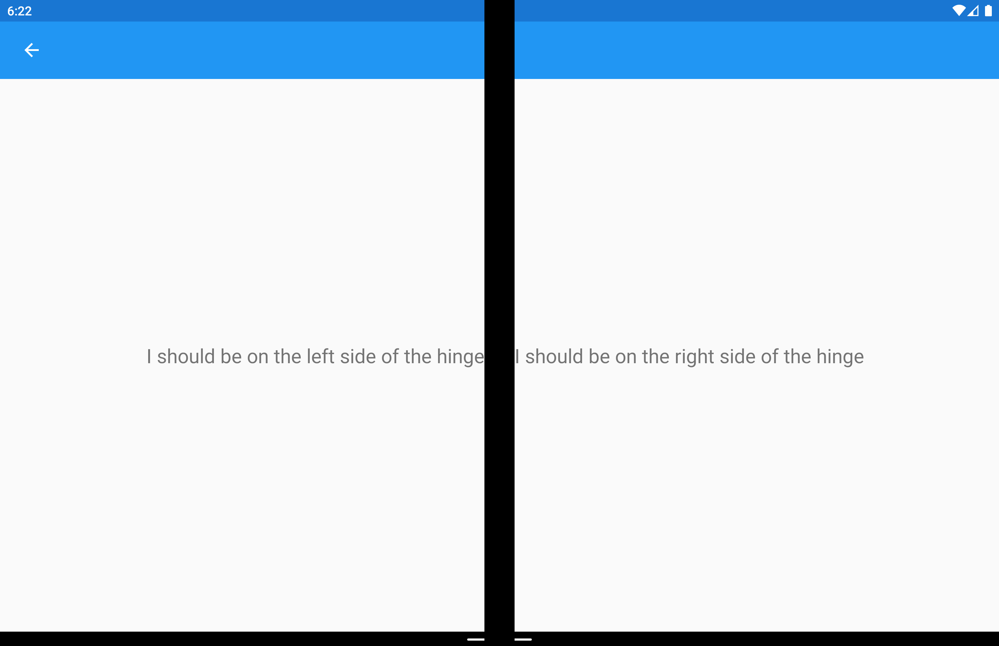

# Xamarin.Forms DualScreenInfo helper class

[ Download the sample](https://docs.microsoft.com/samples/xamarin/xamarin-forms-samples/userinterface-dualscreendemos/)

The `DualScreenInfo` class enables you to determine which pane your view is on, how big it is, what posture the device is in, the angle of the hinge, and more.

## Configure DualScreenInfo

Follow these instructions to create a dual-screen layout in your app:

1. Follow the [get started](index.md) instructions to add the NuGet and configure the Android `MainActivity` class.
1. Add `using Xamarin.Forms.DualScreen;` to your class file.
1. Use the `DualScreenInfo.Current` class in your app.

## Properties

- `SpanningBounds` returns, when spanned across two screens, two rectangles indicating the bounds of each visible area. If the window isn't spanned this will return an empty array.
- `HingeBounds` indicates the position of the hinge on the screen.
- `IsLandscape` indicates if the device is landscape. This is useful because native orientation APIs don't report orientation correctly when an application is spanned.
- `SpanMode` indicates if the layout is in tall, wide, or single pane mode.

In addition, the `PropertyChanged` event fires when any properties change, and the `HingeAngleChanged` event fires when the hinge angle changes.

## Poll hinge angle on Android and UWP

The following method is available when accessing `DualScreenInfo` from Android and UWP platform projects:

- `GetHingeAngleAsync` retrieves the current angle of the device hinge. When using the simulator the HingeAngle can be set by modifying the Pressure sensor.

This method can be invoked from custom renderers on Android and UWP. The following code shows an Android custom renderer example:

```csharp
public class HingeAngleLabelRenderer : Xamarin.Forms.Platform.Android.FastRenderers.LabelRenderer
{
    System.Timers.Timer _hingeTimer;
    public HingeAngleLabelRenderer(Context context) : base(context)
    {
    }

    async void OnTimerElapsed(object sender, System.Timers.ElapsedEventArgs e)
    {
        if (_hingeTimer == null)
            return;

        _hingeTimer.Stop();
        var hingeAngle = await DualScreenInfo.Current.GetHingeAngleAsync();

        Device.BeginInvokeOnMainThread(() =>
        {
            if (_hingeTimer != null)
                Element.Text = hingeAngle.ToString();
        });

        if (_hingeTimer != null)
            _hingeTimer.Start();
    }

    protected override void OnElementChanged(ElementChangedEventArgs<Label> e)
    {
        base.OnElementChanged(e);

        if (_hingeTimer == null)
        {
            _hingeTimer = new System.Timers.Timer(100);
            _hingeTimer.Elapsed += OnTimerElapsed;
            _hingeTimer.Start();
        }
    }

    protected override void Dispose(bool disposing)
    {
        if (_hingeTimer != null)
        {
            _hingeTimer.Elapsed -= OnTimerElapsed;
            _hingeTimer.Stop();
            _hingeTimer = null;
        }

        base.Dispose(disposing);
    }
}
```

## Access DualScreenInfo in your application window

The following code shows how to access `DualScreenInfo` for your application window:

```csharp
DualScreenInfo currentWindow = DualScreenInfo.Current;

// Retrieve absolute position of the hinge on the screen
var hingeBounds = currentWindow.HingeBounds;

// check if app window is spanned across two screens
if(currentWindow.SpanMode == TwoPaneViewMode.SinglePane)
{
    // window is only on one screen
}
else if(currentWindow.SpanMode == TwoPaneViewMode.Tall)
{
    // window is spanned across two screens and oriented top-bottom
}
else if(currentWindow.SpanMode == TwoPaneViewMode.Wide)
{
    // window is spanned across two screens and oriented side-by-side
}

// Detect if any of the properties on DualScreenInfo change.
// This is useful to detect if the app window gets spanned
// across two screens or put on only one  
currentWindow.PropertyChanged += OnDualScreenInfoChanged;
```

## Apply DualScreenInfo to layouts

The `DualScreenInfo` class has a constructor that can take a layout and will give you information about the layout relative to the devices two screens:

```xaml
<Grid x:Name="grid" ColumnSpacing="0">
    <Grid.ColumnDefinitions>
        <ColumnDefinition Width="{Binding Column1Width}" />
        <ColumnDefinition Width="{Binding Column2Width}" />
        <ColumnDefinition Width="{Binding Column3Width}" />
    </Grid.ColumnDefinitions>
    <Label FontSize="Large"
           VerticalOptions="Center"
           HorizontalOptions="End"
           Text="I should be on the left side of the hinge" />
    <Label FontSize="Large"
           VerticalOptions="Center"
           HorizontalOptions="Start"
           Grid.Column="2"
           Text="I should be on the right side of the hinge" />
</Grid>
```

```csharp
public partial class GridUsingDualScreenInfo : ContentPage
{
    public DualScreenInfo DualScreenInfo { get; }
    public double Column1Width { get; set; }
    public double Column2Width { get; set; }
    public double Column3Width { get; set; }

    public GridUsingDualScreenInfo()
    {
        InitializeComponent();
        DualScreenInfo = new DualScreenInfo(grid);
        BindingContext = this;
    }

    protected override void OnAppearing()
    {
        base.OnAppearing();
        DualScreenInfo.PropertyChanged += OnInfoPropertyChanged;
        UpdateColumns();
    }

    protected override void OnDisappearing()
    {
        base.OnDisappearing();
        DualScreenInfo.PropertyChanged -= OnInfoPropertyChanged;
    }

    void UpdateColumns()
    {
        // Check if grid is on two screens
        if (DualScreenInfo.SpanningBounds.Length > 0)
        {
            // set the width of the first column to the width of the layout
            // that's on the left screen
            Column1Width = DualScreenInfo.SpanningBounds[0].Width;

            // set the middle column to the width of the hinge
            Column2Width = DualScreenInfo.HingeBounds.Width;

            // set the width of the third column to the width of the layout
            // that's on the right screen
            Column3Width = DualScreenInfo.SpanningBounds[1].Width;
        }
        else
        {
            Column1Width = 100;
            Column2Width = 0;
            Column3Width = 100;
        }

        OnPropertyChanged(nameof(Column1Width));
        OnPropertyChanged(nameof(Column2Width));
        OnPropertyChanged(nameof(Column3Width));

    }

    void OnInfoPropertyChanged(object sender, System.ComponentModel.PropertyChangedEventArgs e)
    {
        UpdateColumns();
    }
}
```

The following screenshot shows the resulting layout:



## Related links

- [DualScreen (sample)](https://docs.microsoft.com/samples/xamarin/xamarin-forms-samples/userinterface-dualscreendemos/)
