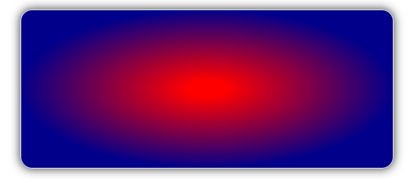
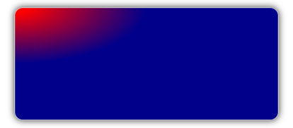
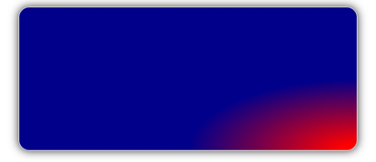

# Xamarin.Forms Brushes: Radial gradients


[ Download the sample](/samples/xamarin/xamarin-forms-samples/userinterface-brushdemos/)

The `RadialGradientBrush` class derives from the `GradientBrush` class, and paints an area with a radial gradient, which blends two or more colors across a circle. `GradientStop` objects are used to specify the colors in the gradient and their positions. For more information about `GradientStop` objects, see [Xamarin.Forms Brushes: Gradients](gradient.md).

The `RadialGradientBrush` class defines the following properties:

- `Center`, of type [`Point`](xref:Xamarin.Forms.Point), which represents the center point of the circle for the radial gradient. The default value of this property is (0.5,0.5).
- `Radius`, of type `double`, which represents the radius of the circle for the radial gradient. The default value of this property is 0.5.

These properties are backed by [`BindableProperty`](xref:Xamarin.Forms.BindableProperty) objects, which means that they can be targets of data bindings, and styled.

The `RadialGradientBrush` class also has an `IsEmpty` method that returns a `bool` that represents whether the brush has been assigned any `GradientStop` objects.

> [!NOTE]
> Radial gradients can also be created with the `radial-gradient()` CSS function.

## Create a RadialGradientBrush

A radial gradient brush's gradient stops are positioned along a gradient axis defined by a circle. The gradient axis radiates from the center of the circle to its circumference. The position and size of the circle can be changed using the brush's `Center` and `Radius` properties. The circle defines the end point of the gradient. Therefore, a gradient stop at 1.0 defines the color at the circle's circumference. A gradient stop at 0.0 defines the color at the center of the circle.

To create a radial gradient, create a `RadialGradientBrush` object and set its `Center` and `Radius` properties. Then, add two or more `GradientStop` objects to the `RadialGradientBrush.GradientStops` collection, that specify the colors in the gradient and their positions.

The following XAML example shows a `RadialGradientBrush` that's set as the `Background` of a [`Frame`](xref:Xamarin.Forms.Frame):

```xaml    
<Frame BorderColor="LightGray"
       HasShadow="True"
       CornerRadius="12"
       HeightRequest="120"
       WidthRequest="120">
    <Frame.Background>
        <!-- Center defaults to (0.5,0.5)
             Radius defaults to (0.5) -->
        <RadialGradientBrush>
            <GradientStop Color="Red"
                          Offset="0.1" />
            <GradientStop Color="DarkBlue"
                          Offset="1.0" />
        </RadialGradientBrush>
    </Frame.Background>
</Frame>
```

In this example, the background of the [`Frame`](xref:Xamarin.Forms.Frame) is painted with a `RadialGradientBrush` that interpolates from red to dark blue. The center of the radial gradient is positioned in the center of the `Frame`:



The following XAML example moves the center of the radial gradient to the top-left corner of the [`Frame`](xref:Xamarin.Forms.Frame):

```xaml
<!-- Radius defaults to (0.5) -->
<RadialGradientBrush Center="0.0,0.0">
    <GradientStop Color="Red"
                  Offset="0.1" />
    <GradientStop Color="DarkBlue"
                  Offset="1.0" />
</RadialGradientBrush>
```

In this example, the background of the [`Frame`](xref:Xamarin.Forms.Frame) is painted with a `RadialGradientBrush` that interpolates from red to dark blue. The center of the radial gradient is positioned in the top-left of the `Frame`:



The following XAML example moves the center of the radial gradient to the bottom-right corner of the [`Frame`](xref:Xamarin.Forms.Frame):

```xaml
<!-- Radius defaults to (0.5) -->
<RadialGradientBrush Center="1.0,1.0">
    <GradientStop Color="Red"
                  Offset="0.1" />
    <GradientStop Color="DarkBlue"
                  Offset="1.0" />
</RadialGradientBrush>            
```

In this example, the background of the [`Frame`](xref:Xamarin.Forms.Frame) is painted with a `RadialGradientBrush` that interpolates from red to dark blue. The center of the radial gradient is positioned in the bottom-right of the `Frame`:



## Related links

- [BrushesDemos (sample)](/samples/xamarin/xamarin-forms-samples/userinterface-brushdemos/)
- [Xamarin.Forms Brushes: Gradients](gradient.md)