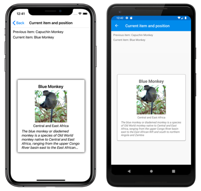
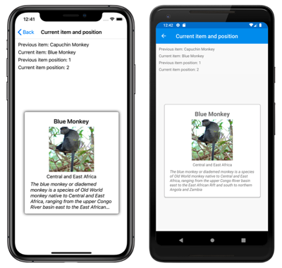
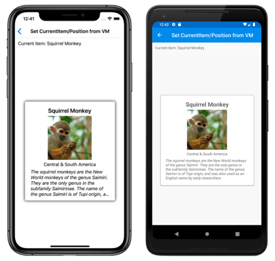
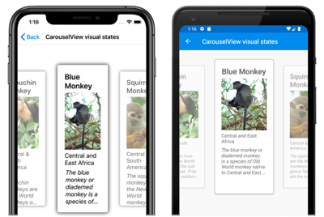

# Xamarin.Forms CarouselView Interaction

[ Download the sample](/samples/xamarin/xamarin-forms-samples/userinterface-carouselviewdemos/)

[`CarouselView`](xref:Xamarin.Forms.CarouselView) defines the following properties that control user interaction:

- `CurrentItem`, of type `object`, the current item being displayed. This property has a default binding mode of `TwoWay`, and has a `null` value when there isn't any data to display.
- `CurrentItemChangedCommand`, of type `ICommand`, which is executed when the current item changes.
- `CurrentItemChangedCommandParameter`, of type `object`, which is the parameter that's passed to the `CurrentItemChangedCommand`.
- `IsBounceEnabled`, of type `bool`, which specifies whether the `CarouselView` will bounce at a content boundary. The default value is `true`.
- `IsSwipeEnabled`, of type `bool`, which determines whether a swipe gesture will change the displayed item. The default value is `true`.
- `Loop`, of type `bool`, which determines whether the `CarouselView` provides looped access to its collection of items. The default value is `true`.
- `Position`, of type `int`, the index of the current item in the underlying collection. This property has a default binding mode of `TwoWay`, and has a 0 value when there isn't any data to display.
- `PositionChangedCommand`, of type `ICommand`, which is executed when the position changes.
- `PositionChangedCommandParameter`, of type `object`, which is the parameter that's passed to the `PositionChangedCommand`.
- `VisibleViews`, of type `ObservableCollection<View>`, which is a read-only property that contains the objects for the items that are currently visible.

All of these properties are backed by [`BindableProperty`](xref:Xamarin.Forms.BindableProperty) objects, which means that the properties can be targets of data bindings.

[`CarouselView`](xref:Xamarin.Forms.CarouselView) defines a `CurrentItemChanged` event that's fired when the `CurrentItem` property changes, either due to user scrolling, or when an application sets the property. The `CurrentItemChangedEventArgs` object that accompanies the `CurrentItemChanged` event has two properties, both of type `object`:

- `PreviousItem` – the previous item, after the property change.
- `CurrentItem` – the current item, after the property change.

[`CarouselView`](xref:Xamarin.Forms.CarouselView) also defines a `PositionChanged` event that's fired when the `Position` property changes, either due to user scrolling, or when an application sets the property. The `PositionChangedEventArgs` object that accompanies the `PositionChanged` event has two properties, both of type `int`:

- `PreviousPosition` – the previous position, after the property change.
- `CurrentPosition` – the current position, after the property change.

## Respond to the current item changing

When the currently displayed item changes, the `CurrentItem` property will be set to the value of the item. When this property changes, the `CurrentItemChangedCommand` is executed with the value of the `CurrentItemChangedCommandParameter` being passed to the `ICommand`. The `Position` property is then updated, and the `CurrentItemChanged` event fires.

> [!IMPORTANT]
> The `Position` property changes when the `CurrentItem` property changes. This will result in the `PositionChangedCommand` being executed, and the `PositionChanged` event firing.

### Event

The following XAML example shows a [`CarouselView`](xref:Xamarin.Forms.CarouselView) that uses an event handler to respond to the current item changing:

```xaml
<CarouselView ItemsSource="{Binding Monkeys}"
              CurrentItemChanged="OnCurrentItemChanged">
    ...
</CarouselView>
```

The equivalent C# code is:

```csharp
CarouselView carouselView = new CarouselView();
carouselView.SetBinding(ItemsView.ItemsSourceProperty, "Monkeys");
carouselView.CurrentItemChanged += OnCurrentItemChanged;
```

In this example, the `OnCurrentItemChanged` event handler is executed when the `CurrentItemChanged` event fires:

```csharp
void OnCurrentItemChanged(object sender, CurrentItemChangedEventArgs e)
{
    Monkey previousItem = e.PreviousItem as Monkey;
    Monkey currentItem = e.CurrentItem as Monkey;
}
```

In this example, the `OnCurrentItemChanged` event handler exposes the previous and current items:

[](interaction-images/current-item-events-large.png#lightbox "CarouselView with current and previous items")

### Command

The following XAML example shows a [`CarouselView`](xref:Xamarin.Forms.CarouselView) that uses a command to respond to the current item changing:

```xaml
<CarouselView ItemsSource="{Binding Monkeys}"
              CurrentItemChangedCommand="{Binding ItemChangedCommand}"
              CurrentItemChangedCommandParameter="{Binding Source={RelativeSource Self}, Path=CurrentItem}">
    ...
</CarouselView>
```

The equivalent C# code is:

```csharp
CarouselView carouselView = new CarouselView();
carouselView.SetBinding(ItemsView.ItemsSourceProperty, "Monkeys");
carouselView.SetBinding(CarouselView.CurrentItemChangedCommandProperty, "ItemChangedCommand");
carouselView.SetBinding(CarouselView.CurrentItemChangedCommandParameterProperty, new Binding("CurrentItem", source: RelativeBindingSource.Self));
```

In this example, the `CurrentItemChangedCommand` property binds to the `ItemChangedCommand` property, passing the `CurrentItem` property value to it as an argument. The `ItemChangedCommand` can then respond to the current item changing, as required:

```csharp
public ICommand ItemChangedCommand => new Command<Monkey>((item) =>
{
    PreviousMonkey = CurrentMonkey;
    CurrentMonkey = item;
});
```

In this example, the `ItemChangedCommand` updates objects that store the previous and current items.

## Respond to the position changing

When the currently displayed item changes, the `Position` property will be set to the index of the current item in the underlying collection. When this property changes, the `PositionChangedCommand` is executed with the value of the `PositionChangedCommandParameter` being passed to the `ICommand`. The `PositionChanged` event then fires. If the `Position` property has been programmatically changed, the [`CarouselView`](xref:Xamarin.Forms.CarouselView) will be scrolled to the item that corresponds to the `Position` value.

> [!NOTE]
> Setting the `Position` property to 0 will result in the first item in the underlying collection being displayed.

### Event

The following XAML example shows a [`CarouselView`](xref:Xamarin.Forms.CarouselView) that uses an event handler to respond to the `Position` property changing:

```xaml
<CarouselView ItemsSource="{Binding Monkeys}"              
              PositionChanged="OnPositionChanged">
    ...
</CarouselView>
```

The equivalent C# code is:

```csharp
CarouselView carouselView = new CarouselView();
carouselView.SetBinding(ItemsView.ItemsSourceProperty, "Monkeys");
carouselView.PositionChanged += OnPositionChanged;
```

In this example, the `OnPositionChanged` event handler is executed when the `PositionChanged` event fires:

```csharp
void OnPositionChanged(object sender, PositionChangedEventArgs e)
{
    int previousItemPosition = e.PreviousPosition;
    int currentItemPosition = e.CurrentPosition;
}
```

In this example, the `OnCurrentItemChanged` event handler exposes the previous and current positions:

[](interaction-images/current-position-events-large.png#lightbox "CarouselView with current and previous positions")

### Command

The following XAML example shows a [`CarouselView`](xref:Xamarin.Forms.CarouselView) that uses a command to respond to the `Position` property changing:

```xaml
<CarouselView ItemsSource="{Binding Monkeys}"
              PositionChangedCommand="{Binding PositionChangedCommand}"
              PositionChangedCommandParameter="{Binding Source={RelativeSource Self}, Path=Position}">
    ...
</CarouselView>
```

The equivalent C# code is:

```csharp
CarouselView carouselView = new CarouselView();
carouselView.SetBinding(ItemsView.ItemsSourceProperty, "Monkeys");
carouselView.SetBinding(CarouselView.PositionChangedCommandProperty, "PositionChangedCommand");
carouselView.SetBinding(CarouselView.PositionChangedCommandParameterProperty, new Binding("Position", source: RelativeBindingSource.Self));
```

In this example, the `PositionChangedCommand` property binds to the `PositionChangedCommand` property, passing the `Position` property value to it as an argument. The `PositionChangedCommand` can then respond to the position changing, as required:

```csharp
public ICommand PositionChangedCommand => new Command<int>((position) =>
{
    PreviousPosition = CurrentPosition;
    CurrentPosition = position;
});
```

In this example, the `PositionChangedCommand` updates objects that store the previous and current positions.

## Preset the current item

The current item in a [`CarouselView`](xref:Xamarin.Forms.CarouselView) can be programmatically set by setting the `CurrentItem` property to the item. The following XAML example shows a `CarouselView` that pre-chooses the current item:

```xaml
<CarouselView ItemsSource="{Binding Monkeys}"
              CurrentItem="{Binding CurrentItem}">
    ...
</CarouselView>
```

The equivalent C# code is:

```csharp
CarouselView carouselView = new CarouselView();
carouselView.SetBinding(ItemsView.ItemsSourceProperty, "Monkeys");
carouselView.SetBinding(CarouselView.CurrentItemProperty, "CurrentItem");
```

> [!NOTE]
> The `CurrentItem` property has a default binding mode of `TwoWay`.

The `CarouselView.CurrentItem` property data binds to the `CurrentItem` property of the connected view model, which is of type `Monkey`. By default, a `TwoWay` binding is used so that if the user changes the current item, the value of the `CurrentItem` property will be set to the current `Monkey` object. The `CurrentItem` property is defined in the `MonkeysViewModel` class:

```csharp
public class MonkeysViewModel : INotifyPropertyChanged
{
    // ...
    public ObservableCollection<Monkey> Monkeys { get; private set; }

    public Monkey CurrentItem { get; set; }

    public MonkeysViewModel()
    {
        // ...
        CurrentItem = Monkeys.Skip(3).FirstOrDefault();
        OnPropertyChanged("CurrentItem");
    }
}
```

In this example, the `CurrentItem` property is set to the fourth item in the `Monkeys` collection:

[](interaction-images/preset-item-large.png#lightbox "CarouselView with preset item")

## Preset the position

The displayed item [`CarouselView`](xref:Xamarin.Forms.CarouselView) can be programmatically set by setting the `Position` property to the index of the item in the underlying collection. The following XAML example shows a `CarouselView` that sets the displayed item:

```xaml
<CarouselView ItemsSource="{Binding Monkeys}"
              Position="{Binding Position}">
    ...
</CarouselView>
```

The equivalent C# code is:

```csharp
CarouselView carouselView = new CarouselView();
carouselView.SetBinding(ItemsView.ItemsSourceProperty, "Monkeys");
carouselView.SetBinding(CarouselView.PositionProperty, "Position");
```

> [!NOTE]
> The `Position` property has a default binding mode of `TwoWay`.

The `CarouselView.Position` property data binds to the `Position` property of the connected view model, which is of type `int`. By default, a `TwoWay` binding is used so that if the user scrolls through the [`CarouselView`](xref:Xamarin.Forms.CarouselView), the value of the `Position` property will be set to the index of the displayed item. The `Position` property is defined in the `MonkeysViewModel` class:

```csharp
public class MonkeysViewModel : INotifyPropertyChanged
{
    // ...
    public int Position { get; set; }

    public MonkeysViewModel()
    {
        // ...
        Position = 3;
        OnPropertyChanged("Position");
    }
}
```

In this example, the `Position` property is set to the fourth item in the `Monkeys` collection:

[](interaction-images/preset-position-large.png#lightbox "CarouselView with preset position")

## Define visual states

[`CarouselView`](xref:Xamarin.Forms.CarouselView) defines four visual states:

- `CurrentItem` represents the visual state for the currently displayed item.
- `PreviousItem` represents the visual state for the previously displayed item.
- `NextItem` represents the visual state for the next item.
- `DefaultItem` represents the visual state for the remainder of the items.

These visual states can be used to initiate visual changes to the items displayed by the [`CarouselView`](xref:Xamarin.Forms.CarouselView).

The following XAML example shows how to define the `CurrentItem`, `PreviousItem`, `NextItem`, and `DefaultItem` visual states:

```xaml
<CarouselView ItemsSource="{Binding Monkeys}"
              PeekAreaInsets="100">
    <CarouselView.ItemTemplate>
        <DataTemplate>
            <StackLayout>
                <VisualStateManager.VisualStateGroups>
                    <VisualStateGroup x:Name="CommonStates">
                        <VisualState x:Name="CurrentItem">
                            <VisualState.Setters>
                                <Setter Property="Scale"
                                        Value="1.1" />
                            </VisualState.Setters>
                        </VisualState>
                        <VisualState x:Name="PreviousItem">
                            <VisualState.Setters>
                                <Setter Property="Opacity"
                                        Value="0.5" />
                            </VisualState.Setters>
                        </VisualState>
                        <VisualState x:Name="NextItem">
                            <VisualState.Setters>
                                <Setter Property="Opacity"
                                        Value="0.5" />
                            </VisualState.Setters>
                        </VisualState>
                        <VisualState x:Name="DefaultItem">
                            <VisualState.Setters>
                                <Setter Property="Opacity"
                                        Value="0.25" />
                            </VisualState.Setters>
                        </VisualState>
                    </VisualStateGroup>
                </VisualStateManager.VisualStateGroups>

                <!-- Item template content -->
                <Frame HasShadow="true">
                    ...
                </Frame>
            </StackLayout>
        </DataTemplate>
    </CarouselView.ItemTemplate>
</CarouselView>
```

In this example, the `CurrentItem` visual state specifies that the current item displayed by the [`CarouselView`](xref:Xamarin.Forms.CarouselView) will have its [`Scale`](xref:Xamarin.Forms.VisualElement.Scale) property changed from its default value of 1 to 1.1. The `PreviousItem` and `NextItem` visual states specify that the items surrounding the current item will be displayed with an [`Opacity`](xref:Xamarin.Forms.VisualElement.Opacity) value of 0.5. The `DefaultItem` visual state specifies that the remainder of the items displayed by the `CarouselView` will be displayed with an `Opacity` value of 0.25.

> [!NOTE]
> Alternatively, the visual states can be defined in a [`Style`](xref:Xamarin.Forms.Style) that has a [`TargetType`](xref:Xamarin.Forms.Style.TargetType) property value that's the type of the root element of the [`DataTemplate`](xref:Xamarin.Forms.DataTemplate), which is set as the `ItemTemplate` property value.

The following screenshots show the `CurrentItem`, `PreviousItem`, and `NextItem` visual states:

[](interaction-images/visual-states-large.png#lightbox "CarouselView visual states")

For more information about visual states, see [Xamarin.Forms Visual State Manager](~/xamarin-forms/user-interface/visual-state-manager.md).

## Clear the current item

The `CurrentItem` property can be cleared by setting it, or the object it binds to, to `null`.

## Disable bounce

By default, [`CarouselView`](xref:Xamarin.Forms.CarouselView) bounces items at content boundaries. This can be disabled by setting the `IsBounceEnabled` property to `false`.

## Disable loop

By default, [`CarouselView`](xref:Xamarin.Forms.CarouselView) provides looped access to its collection of items. Therefore, swiping backwards from the first item in the collection will display the last item in the collection. Similarly, swiping forwards from the last item in the collection will return to the first item in the collection. This behavior can be disabled by setting the `Loop` property to `false`.

## Disable swipe interaction

By default, [`CarouselView`](xref:Xamarin.Forms.CarouselView) allows users to move through items using a swipe gesture. This swipe interaction can be disabled by setting the `IsSwipeEnabled` property to `false`.

## Related links

- [CarouselView (sample)](/samples/xamarin/xamarin-forms-samples/userinterface-carouselviewdemos/)
- [Xamarin.Forms Visual State Manager](~/xamarin-forms/user-interface/visual-state-manager.md)