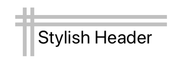
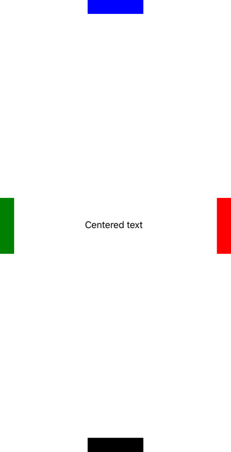

# Xamarin.Forms AbsoluteLayout

[ Download the sample](https://docs.microsoft.com/samples/xamarin/xamarin-forms-samples/userinterface-absolutelayoutdemos)

[](absolutelayout-images/layouts-large.png#lightbox)

An [`AbsoluteLayout`](xref:Xamarin.Forms.AbsoluteLayout) is used to position and size children using explicit values. The position is specified by the upper-left corner of the child relative to the upper-left corner of the `AbsoluteLayout`, in device-independent units. `AbsoluteLayout` also implements a proportional positioning and sizing feature. In addition, unlike some other layout classes, `AbsoluteLayout` is able to position children so that they overlap.

An [`AbsoluteLayout`](xref:Xamarin.Forms.AbsoluteLayout) should be regarded as a special-purpose layout to be used only when you can impose a size on children, or when the element's size doesn't affect the positioning of other children.

The [`AbsoluteLayout`](xref:Xamarin.Forms.AbsoluteLayout) class defines the following properties:

- [`LayoutBounds`](xref:Xamarin.Forms.AbsoluteLayout.LayoutBoundsProperty), of type [`Rectangle`](xref:Xamarin.Forms.Rectangle), which is an attached property that represents the position and size of a child. The default value of this property is (0,0,AutoSize,AutoSize).
- [`LayoutFlags`](xref:Xamarin.Forms.AbsoluteLayout.LayoutFlagsProperty), of type [`AbsoluteLayoutFlags`](xref:Xamarin.Forms.AbsoluteLayoutFlags), which is an attached property that indicates whether properties of the layout bounds used to position and size the child are interpreted proportionally. The default value of this property is `AbsoluteLayoutFlags.None`.

These properties are backed by [`BindableProperty`](xref:Xamarin.Forms.BindableProperty) objects, which means that the properties can be targets of data bindings and styled. For more information about attached properties, see [Xamarin.Forms Attached Properties](~/xamarin-forms/xaml/attached-properties.md).

The [`AbsoluteLayout`](xref:Xamarin.Forms.AbsoluteLayout) class derives from the `Layout<T>` class, which defines a `Children` property of type `IList<T>`. The `Children` property is the `ContentProperty` of the `Layout<T>` class, and therefore does not need to be explicitly set from XAML.

> [!TIP]
> To obtain the best possible layout performance, follow the guidelines at [Optimize layout performance](~/xamarin-forms/deploy-test/performance.md#optimize-layout-performance).

## Position and size children

The position and size of children in an [`AbsoluteLayout`](xref:Xamarin.Forms.AbsoluteLayout) is defined by setting the [`AbsoluteLayout.LayoutBounds`](xref:Xamarin.Forms.AbsoluteLayout.LayoutBoundsProperty) attached property of each child, using absolute values or proportional values. Absolute and proportional values can be mixed for children when the position should scale, but the size should stay fixed, or vice versa. For information about absolute values, see [Absolute positioning and sizing](#absolute-positioning-and-sizing). For information about proportional values, see [Proportional positioning and sizing](#proportional-positioning-and-sizing).

The [`AbsoluteLayout.LayoutBounds`](xref:Xamarin.Forms.AbsoluteLayout.LayoutBoundsProperty) attached property can be set using two formats, regardless of whether absolute or proportional values are used:

- `x, y`. With this format, the `x` and `y` values indicate the position of the upper-left corner of the child relative to its parent. The child is unconstrained and sizes itself.
- `x, y, width, height`. With this format, the `x` and `y` values indicate the position of the upper-left corner of the child relative to its parent, while the `width` and `height` values indicate the child's size.

To specify that a child sizes itself horizontally or vertically, or both, set the `width` and/or `height` values to the [`AbsoluteLayout.AutoSize`](xref:Xamarin.Forms.AbsoluteLayout.AutoSize) property. However, overuse of this property can harm application performance, as it causes the layout engine to perform additional layout calculations.

> [!IMPORTANT]
> The [`HorizontalOptions`](xref:Xamarin.Forms.View.HorizontalOptions) and [`VerticalOptions`](xref:Xamarin.Forms.View.VerticalOptions) properties have no effect on children of an [`AbsoluteLayout`](xref:Xamarin.Forms.AbsoluteLayout).

## Absolute positioning and sizing

By default, an [`AbsoluteLayout`](xref:Xamarin.Forms.AbsoluteLayout) positions and sizes children using absolute values, specified in device-independent units, which explicitly define where children should be placed in the layout. This is achieved by adding children to the `Children` collection of an `AbsoluteLayout` and setting the [`AbsoluteLayout.LayoutBounds`](xref:Xamarin.Forms.AbsoluteLayout.LayoutBoundsProperty) attached property on each child to absolute position and/or size values.

> [!WARNING]
> Using absolute values for positioning and sizing children can be problematic, because different devices have different screen sizes and resolutions. Therefore, the coordinates for the center of the screen on one device may be offset on other devices.

The following XAML shows an [`AbsoluteLayout`](xref:Xamarin.Forms.AbsoluteLayout) whose children are positioned using absolute values:

```xaml
<ContentPage xmlns="http://xamarin.com/schemas/2014/forms"
             xmlns:x="http://schemas.microsoft.com/winfx/2009/xaml"
             x:Class="AbsoluteLayoutDemos.Views.StylishHeaderDemoPage"
             Title="Stylish header demo">
    <AbsoluteLayout Margin="20">
        <BoxView Color="Silver"
                 AbsoluteLayout.LayoutBounds="0, 10, 200, 5" />
        <BoxView Color="Silver"
                 AbsoluteLayout.LayoutBounds="0, 20, 200, 5" />
        <BoxView Color="Silver"
                 AbsoluteLayout.LayoutBounds="10, 0, 5, 65" />
        <BoxView Color="Silver"
                 AbsoluteLayout.LayoutBounds="20, 0, 5, 65" />
        <Label Text="Stylish Header"
               FontSize="24"
               AbsoluteLayout.LayoutBounds="30, 25" />
    </AbsoluteLayout>
</ContentPage>
```

In this example, the position of each [`BoxView`](xref:Xamarin.Forms.BoxView) object is defined using the first two absolute values that are specified in the [`AbsoluteLayout.LayoutBounds`](xref:Xamarin.Forms.AbsoluteLayout.LayoutBoundsProperty) attached property. The size of each `BoxView` is defined using the third and forth values. The position of the [`Label`](xref:Xamarin.Forms.Label) object is defined using the two absolute values that are specified in the `AbsoluteLayout.LayoutBounds` attached property. Size values are not specified for the `Label`, and so it's unconstrained and sizes itself. In all cases, the absolute values represent device-independent units.

The following screenshot shows the resulting layout:



The equivalent C# code is shown below:

```csharp
public class StylishHeaderDemoPageCS : ContentPage
{
    public StylishHeaderDemoPageCS()
    {
        AbsoluteLayout absoluteLayout = new AbsoluteLayout
        {
            Margin = new Thickness(20)
        };

        absoluteLayout.Children.Add(new BoxView
        {
            Color = Color.Silver,
        }, new Rectangle(0, 10, 200, 5));
        absoluteLayout.Children.Add(new BoxView
        {
            Color = Color.Silver
        }, new Rectangle(0, 20, 200, 5));
        absoluteLayout.Children.Add(new BoxView
        {
            Color = Color.Silver
        }, new Rectangle(10, 0, 5, 65));
        absoluteLayout.Children.Add(new BoxView
        {
            Color = Color.Silver
        }, new Rectangle(20, 0, 5, 65));

        absoluteLayout.Children.Add(new Label
        {
            Text = "Stylish Header",
            FontSize = 24
        }, new Point(30,25));                    

        Title = "Stylish header demo";
        Content = absoluteLayout;
    }
}
```

In this example, the position and size of each [`BoxView`](xref:Xamarin.Forms.BoxView) is defined using a [`Rectangle`](xref:Xamarin.Forms.Rectangle) object. The position of the [`Label`](xref:Xamarin.Forms.Label) is defined using a [`Point`](xref:Xamarin.Forms.Point) object.

In C#, it's also possible to set the position and size of a child of an [`AbsoluteLayout`](xref:Xamarin.Forms.AbsoluteLayout) after it has been added to the `Children` collection, using the [`AbsoluteLayout.SetLayoutBounds`](xref:Xamarin.Forms.AbsoluteLayout.SetLayoutBounds*) method. The first argument to this method is the child, and the second is a [`Rectangle`](xref:Xamarin.Forms.Rectangle) object.

> [!NOTE]
> An [`AbsoluteLayout`](xref:Xamarin.Forms.AbsoluteLayout) that uses absolute values can position and size children so that they don't fit within the bounds of the layout.

## Proportional positioning and sizing

An [`AbsoluteLayout`](xref:Xamarin.Forms.AbsoluteLayout) can position and size children using proportional values. This is achieved by adding children to the `Children` collection of the `AbsoluteLayout`, and by setting the [`AbsoluteLayout.LayoutBounds`](xref:Xamarin.Forms.AbsoluteLayout.LayoutBoundsProperty) attached property on each child to proportional position and/or size values in the range 0-1. Position and size values are made proportional by setting the [`AbsoluteLayout.LayoutFlags`](xref:Xamarin.Forms.AbsoluteLayout.LayoutFlagsProperty) attached property on each child.

The [`AbsoluteLayout.LayoutFlags`](xref:Xamarin.Forms.AbsoluteLayout.LayoutFlagsProperty) attached property, of type [`AbsoluteLayoutFlags`](xref:Xamarin.Forms.AbsoluteLayoutFlags), allows you to set a flag that indicates that the layout bounds position and size values for a child are proportional to the size of the `AbsoluteLayout`. When laying out a child, `AbsoluteLayout` scales the position and size values appropriately, to any device size.

The [`AbsoluteLayoutFlags`](xref:Xamarin.Forms.AbsoluteLayoutFlags) enumeration defines the following members:

- `None`, indicates that values will be interpreted as absolute. This is the default value of the [`AbsoluteLayout.LayoutFlags`](xref:Xamarin.Forms.AbsoluteLayout.LayoutFlagsProperty) attached property.
- `XProportional`, indicates that the `x` value will be interpreted as proportional, while treating all other values as absolute.
- `YProportional`, indicates that the `y` value will be interpreted as proportional, while treating all other values as absolute.
- `WidthProportional`, indicates that the `width` value will be interpreted as proportional, while treating all other values as absolute.
- `HeightProportional`, indicates that the `height` value will be interpreted as proportional, while treating all other values as absolute.
- `PositionProportional`, indicates that the `x` and `y` values will be interpreted as proportional, while the size values are interpreted as absolute.
- `SizeProportional`, indicates that the `width` and `height` values will be interpreted as proportional, while the position values are interpreted as absolute.
- `All`, indicates that all values will be interpreted as proportional.

> [!TIP]
> The [`AbsoluteLayoutFlags`](xref:Xamarin.Forms.AbsoluteLayoutFlags) enumeration is a `Flags` enumeration, which means that enumeration members can be combined. This is accomplished in XAML with a comma-separated list, and in C# with the bitwise OR operator.

For example, if you use the `SizeProportional` flag and set the width of a child to 0.25 and the height to 0.1, the child will be one-quarter of the width of the [`AbsoluteLayout`](xref:Xamarin.Forms.AbsoluteLayout) and one-tenth the height. The `PositionProportional` flag is similar. A position of (0,0) puts the child in the upper-left corner, while a position of (1,1) puts the child in the lower-right corner, and a position of (0.5,0.5) centers the child within the `AbsoluteLayout`.

The following XAML shows an [`AbsoluteLayout`](xref:Xamarin.Forms.AbsoluteLayout) whose children are positioned using proportional values:

```xaml
<ContentPage xmlns="http://xamarin.com/schemas/2014/forms"
             xmlns:x="http://schemas.microsoft.com/winfx/2009/xaml"
             x:Class="AbsoluteLayoutDemos.Views.ProportionalDemoPage"
             Title="Proportional demo">
    <AbsoluteLayout>
        <BoxView Color="Blue"
                 AbsoluteLayout.LayoutBounds="0.5,0,100,25"
                 AbsoluteLayout.LayoutFlags="PositionProportional" />
        <BoxView Color="Green"
                 AbsoluteLayout.LayoutBounds="0,0.5,25,100"
                 AbsoluteLayout.LayoutFlags="PositionProportional" />
        <BoxView Color="Red"
                 AbsoluteLayout.LayoutBounds="1,0.5,25,100"
                 AbsoluteLayout.LayoutFlags="PositionProportional" />
        <BoxView Color="Black"
                 AbsoluteLayout.LayoutBounds="0.5,1,100,25"
                 AbsoluteLayout.LayoutFlags="PositionProportional" />
        <Label Text="Centered text"
               AbsoluteLayout.LayoutBounds="0.5,0.5,110,25"
               AbsoluteLayout.LayoutFlags="PositionProportional" />
    </AbsoluteLayout>
</ContentPage>
```

In this example, each child is positioned using proportional values but sized using absolute values. This is accomplished by setting the [`AbsoluteLayout.LayoutFlags`](xref:Xamarin.Forms.AbsoluteLayout.LayoutFlagsProperty) attached property of each child to `PositionProportional`. The first two values that are specified in the [`AbsoluteLayout.LayoutBounds`](xref:Xamarin.Forms.AbsoluteLayout.LayoutBoundsProperty) attached property, for each child, define the position using proportional values. The size of each child is defined with the third and forth absolute values, using device-independent units.

The following screenshot shows the resulting layout:



The equivalent C# code is shown below:

```csharp
public class ProportionalDemoPageCS : ContentPage
{
    public ProportionalDemoPageCS()
    {
        BoxView blue = new BoxView { Color = Color.Blue };
        AbsoluteLayout.SetLayoutBounds(blue, new Rectangle(0.5, 0, 100, 25));
        AbsoluteLayout.SetLayoutFlags(blue, AbsoluteLayoutFlags.PositionProportional);

        BoxView green = new BoxView { Color = Color.Green };
        AbsoluteLayout.SetLayoutBounds(green, new Rectangle(0, 0.5, 25, 100));
        AbsoluteLayout.SetLayoutFlags(green, AbsoluteLayoutFlags.PositionProportional);

        BoxView red = new BoxView { Color = Color.Red };
        AbsoluteLayout.SetLayoutBounds(red, new Rectangle(1, 0.5, 25, 100));
        AbsoluteLayout.SetLayoutFlags(red, AbsoluteLayoutFlags.PositionProportional);

        BoxView black = new BoxView { Color = Color.Black };
        AbsoluteLayout.SetLayoutBounds(black, new Rectangle(0.5, 1, 100, 25));
        AbsoluteLayout.SetLayoutFlags(black, AbsoluteLayoutFlags.PositionProportional);

        Label label = new Label { Text = "Centered text" };
        AbsoluteLayout.SetLayoutBounds(label, new Rectangle(0.5, 0.5, 110, 25));
        AbsoluteLayout.SetLayoutFlags(label, AbsoluteLayoutFlags.PositionProportional);

        Title = "Proportional demo";
        Content = new AbsoluteLayout
        {
            Children = { blue, green, red, black, label }
        };
    }
}
```

In this example, the position and size of each child is set with the [`AbsoluteLayout.SetLayoutBounds`](xref:Xamarin.Forms.AbsoluteLayout.SetLayoutBounds*) method. The first argument to the method is the child, and the second is a [`Rectangle`](xref:Xamarin.Forms.Rectangle) object. The position of each child is set with proportional values, while the size of each child is set with absolute values, using device-independent units.

> [!NOTE]
> An [`AbsoluteLayout`](xref:Xamarin.Forms.AbsoluteLayout) that uses proportional values can position and size children so that they don't fit within the bounds of the layout by using values outside the 0-1 range.

## Related links

- [AbsoluteLayout demos (sample)](https://docs.microsoft.com/samples/xamarin/xamarin-forms-samples/userinterface-absolutelayoutdemos)
- [Xamarin.Forms Attached Properties](~/xamarin-forms/xaml/attached-properties.md)
- [Choose a Xamarin.Forms Layout](choose-layout.md)
- [Improve Xamarin.Forms App Performance](~/xamarin-forms/deploy-test/performance.md)
