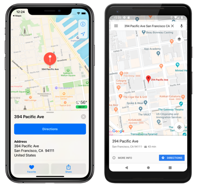
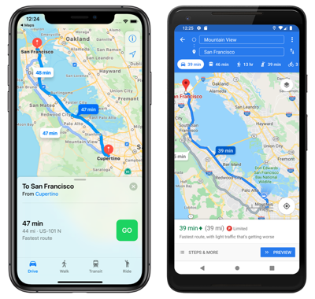

# Launch the Native Map App from Xamarin.Forms

[ Download the sample](https://docs.microsoft.com/samples/xamarin/xamarin-forms-samples/workingwithmaps)

The native map app on each platform can be launched from a Xamarin.Forms application by the Xamarin.Essentials `Launcher` class. This class enables an application to open another app through its custom URI scheme. The launcher functionality can be invoked with the `OpenAsync` method, passing in a `string` or `Uri` argument that represents the custom URL scheme to open. For more information about Xamarin.Essentials, see [Xamarin.Essentials](~/essentials/index.md?context=xamarin/xamarin-forms).

> [!NOTE]
> An alternative to using the Xamarin.Essentials `Launcher` class is to use its `Map` class. For more information, see [Xamarin.Essentials: Map](~/essentials/maps.md?context=xamarin/xamarin-forms).

The maps app on each platform uses a unique custom URI scheme. For information about the maps URI scheme on iOS, see [Map Links](https://developer.apple.com/library/archive/featuredarticles/iPhoneURLScheme_Reference/MapLinks/MapLinks.html) on developer.apple.com. For information about the maps URI scheme on Android, see [Maps Developer Guide](https://developer.android.com/guide/components/intents-common.html#Maps) and [Google Maps Intents for Android](https://developers.google.com/maps/documentation/urls/android-intents) on developers.android.com. For information about the maps URI scheme on the Universal Windows Platform (UWP), see [Launch the Windows Maps app](/windows/uwp/launch-resume/launch-maps-app).

## Launch the map app at a specific location

A location in the native maps app can be opened by adding appropriate query parameters to the custom URI scheme for each map app:

```csharp
if (Device.RuntimePlatform == Device.iOS)
{
    // https://developer.apple.com/library/ios/featuredarticles/iPhoneURLScheme_Reference/MapLinks/MapLinks.html
    await Launcher.OpenAsync("http://maps.apple.com/?q=394+Pacific+Ave+San+Francisco+CA");
}
else if (Device.RuntimePlatform == Device.Android)
{
    // open the maps app directly
    await Launcher.OpenAsync("geo:0,0?q=394+Pacific+Ave+San+Francisco+CA");
}
else if (Device.RuntimePlatform == Device.UWP)
{
    await Launcher.OpenAsync("bingmaps:?where=394 Pacific Ave San Francisco CA");
}
```

This example code results in the native map app being launched on each platform, with the map centered on a pin representing the specified location:

[](native-map-app-images/location-large.png#lightbox "Native map app")

## Launch the map app with directions

The native maps app can be launched displaying directions, by adding appropriate query parameters to the custom URI scheme for each map app:

```csharp
if (Device.RuntimePlatform == Device.iOS)
{
    // https://developer.apple.com/library/ios/featuredarticles/iPhoneURLScheme_Reference/MapLinks/MapLinks.html
    await Launcher.OpenAsync("http://maps.apple.com/?daddr=San+Francisco,+CA&saddr=cupertino");
}
else if (Device.RuntimePlatform == Device.Android)
{
    // opens the 'task chooser' so the user can pick Maps, Chrome or other mapping app
    await Launcher.OpenAsync("http://maps.google.com/?daddr=San+Francisco,+CA&saddr=Mountain+View");
}
else if (Device.RuntimePlatform == Device.UWP)
{
    await Launcher.OpenAsync("bingmaps:?rtp=adr.394 Pacific Ave San Francisco CA~adr.One Microsoft Way Redmond WA 98052");
}
```

This example code results in the native map app being launched on each platform, with the map centered on a route between the specified locations:

[](native-map-app-images/directions-large.png#lightbox "Native map app directions")

## Related links

- [Maps Sample](https://docs.microsoft.com/samples/xamarin/xamarin-forms-samples/workingwithmaps)
- [Xamarin.Essentials](~/essentials/index.md?context=xamarin/xamarin-forms)
- [Map Links](https://developer.apple.com/library/archive/featuredarticles/iPhoneURLScheme_Reference/MapLinks/MapLinks.html)
- [Maps Developer Guide](https://developer.android.com/guide/components/intents-common.html#Maps)
- [Google Maps Intents for Android](https://developers.google.com/maps/documentation/)
- [Launch the Windows Maps app](/windows/uwp/launch-resume/launch-maps-app)
