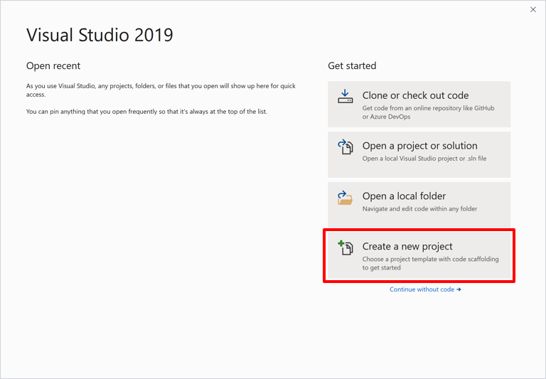
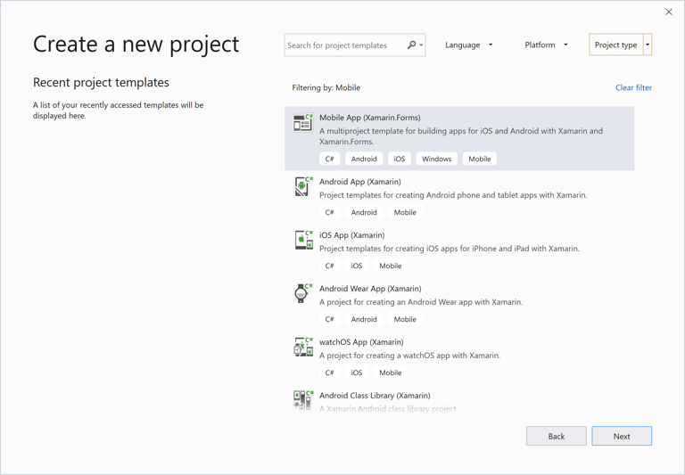
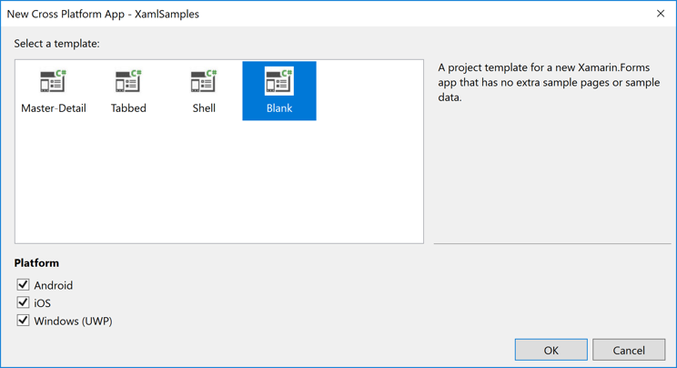
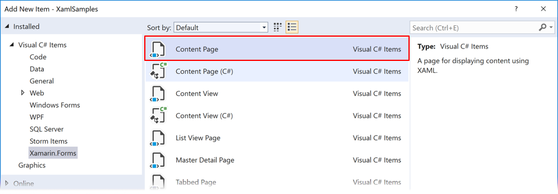

# Part 1. Getting Started with XAML

[ Download the sample](https://docs.microsoft.com/samples/xamarin/xamarin-forms-samples/xamlsamples)

_In a Xamarin.Forms application, XAML is mostly used to define the visual contents of a page and works together with a C# code-behind file._

The code-behind file provides code support for the markup. Together, these two files contribute to a new class definition that includes child views and property initialization. Within the XAML file, classes and properties are referenced with XML elements and attributes, and links between the markup and code are established.

## Creating the Solution

To begin editing your first XAML file, use Visual Studio or Visual Studio for Mac to create a new Xamarin.Forms solution. (Select the tab below corresponding to your environment.)

<!-- markdownlint-disable MD001 -->

# [Visual Studio](#tab/windows)

In Windows, launch Visual Studio 2019, and in the start window click **Create a new project** to create a new project:



In the **Create a new project** window, select **Mobile** in the **Project type** drop down, select the **Mobile App (Xamarin.Forms)** template, and click the **Next** button:



In the **Configure your new project** window, set the **Project name** to **XamlSamples** (or whatever your prefer), and click the **Create** button.

In the **New Cross Platform App** dialog, click **Blank**, and click the **OK** button:



Four projects are created in the solution: the **XamlSamples** .NET Standard library, **XamlSamples.Android**, **XamlSamples.iOS**, and the Universal Windows Platform solution, **XamlSamples.UWP**.

# [Visual Studio for Mac](#tab/macos)

In Visual Studio for Mac, select **File > New Solution** from the menu. In the **New Project** dialog, select **Multiplatform > App** at the left, and **Blank Forms App** (*not* **Forms App**) from the template list:


Press **Next**.

In the next dialog, give the project a name of **XamlSamples** (or whatever you prefer). Make sure that the **Use .NET Standard** radio button is selected:


Press **Next**.

In the following dialog, you can select a location for the project:


Press **Create**

Three projects are created in the solution: the **XamlSamples** .NET Standard library, **XamlSamples.Android**, and **XamlSamples.iOS**.

-----

After creating the **XamlSamples** solution, you might want to test your development environment by selecting the various platform projects as the solution startup project, and building and deploying the simple application created by the project template on either phone emulators or real devices.

Unless you need to write platform-specific code, the shared **XamlSamples** .NET Standard library project is where you’ll be spending virtually all of your programming time. These articles will not venture outside of that project.

### Anatomy of a XAML File

Within the **XamlSamples** .NET Standard library are a pair of files with the following names:

- **App.xaml**, the XAML file; and
- **App.xaml.cs**, a C# *code-behind* file associated with the XAML file.

You'll need to click the arrow next to **App.xaml** to see the code-behind file.

Both **App.xaml** and **App.xaml.cs** contribute to a class named `App` that derives from `Application`. Most other classes with XAML files contribute to a class that derives from `ContentPage`; those files use XAML to define the visual contents of an entire page. This is true of the other two files in the **XamlSamples** project:

- **MainPage.xaml**, the XAML file; and
- **MainPage.xaml.cs**, the C# code-behind file.

The **MainPage.xaml** file looks like this (although the formatting might be a little different):

```xaml
<ContentPage xmlns="http://xamarin.com/schemas/2014/forms"
             xmlns:x="http://schemas.microsoft.com/winfx/2009/xaml"
             xmlns:local="clr-namespace:XamlSamples"
             x:Class="XamlSamples.MainPage">

    <StackLayout>
        <!-- Place new controls here -->
        <Label Text="Welcome to Xamarin Forms!"
               VerticalOptions="Center"
               HorizontalOptions="Center" />
    </StackLayout>

</ContentPage>
```

The two XML namespace (`xmlns`) declarations refer to URIs, the first seemingly on Xamarin’s web site and the second on Microsoft’s. Don’t bother checking what those URIs point to. There’s nothing there. They are simply URIs owned by Xamarin and Microsoft, and they basically function as version identifiers.

The first XML namespace declaration means that tags defined within the XAML file with no prefix refer to classes in Xamarin.Forms, for example `ContentPage`. The second namespace declaration defines a prefix of `x`. This is used for several elements and attributes that are intrinsic to XAML itself and which are supported by other implementations of XAML. However, these elements and attributes are slightly different depending on the year embedded in the URI. Xamarin.Forms supports the 2009 XAML specification, but not all of it.

The `local` namespace declaration allows you to access other classes from the .NET Standard library project.

At the end of that first tag, the `x` prefix is used for an attribute named `Class`. Because the use of this `x` prefix is virtually universal for the XAML namespace, XAML attributes such as `Class` are almost always referred to as `x:Class`.

The `x:Class` attribute specifies a fully qualified .NET class name: the `MainPage` class in the `XamlSamples` namespace. This means that this XAML file defines a new class named `MainPage` in the `XamlSamples` namespace that derives from `ContentPage`—the tag in which the `x:Class` attribute appears.

The `x:Class` attribute can only appear in the root element of a XAML file to define a derived C# class. This is the only new class defined in the XAML file. Everything else that appears in the XAML file is instead simply instantiated from existing classes and initialized.

The **MainPage.xaml.cs** file looks like this (aside from unused `using` directives):

```csharp
using Xamarin.Forms;

namespace XamlSamples
{
    public partial class MainPage : ContentPage
    {
        public MainPage()
        {
            InitializeComponent();
        }
    }
}
```

The `MainPage` class derives from `ContentPage`, but notice the `partial` class definition. This suggests that there should be another partial class definition for `MainPage`, but where is it? And what is that `InitializeComponent` method?

When Visual Studio builds the project, it parses the XAML file to generate a C# code file. If you look in the **XamlSamples\XamlSamples\obj\Debug** directory, you’ll find a file named **XamlSamples.MainPage.xaml.g.cs**. The ‘g’ stands for generated. This is the other partial class definition of `MainPage` that contains the definition of the `InitializeComponent` method called from the `MainPage` constructor. These two partial `MainPage` class definitions can then be compiled together. Depending on whether the XAML is compiled or not, either the XAML file or a binary form of the XAML file is embedded in the executable.

At runtime, code in the particular platform project calls a `LoadApplication` method, passing to it a new instance of the `App` class in the .NET Standard library. The `App` class constructor instantiates `MainPage`. The constructor of that class calls `InitializeComponent`, which then calls the `LoadFromXaml` method that extracts the XAML file (or its compiled binary) from the .NET Standard library. `LoadFromXaml` initializes all the objects defined in the XAML file, connects them all together in parent-child relationships, attaches event handlers defined in code to events set in the XAML file, and sets the resultant tree of objects as the content of the page.

Although you normally don’t need to spend much time with generated code files, sometimes runtime exceptions are raised on code in the generated files, so you should be familiar with them.

When you compile and run this program, the `Label` element appears in the center of the page as the XAML suggests:

[](get-started-with-xaml-images/xamlsamples-large.png#lightbox)

For more interesting visuals, all you need is more interesting XAML.

## Adding New XAML Pages

# [Visual Studio](#tab/windows)

To add other XAML-based `ContentPage` classes to your project, select the **XamlSamples** .NET Standard library project, right-click, and select **Add > New Item...**. In the **Add New Item** dialog, select **Visual C# Items > Xamarin.Forms > Content Page** (not **Content Page (C#)**, which creates a code-only page, or **Content View**, which is not a page). Give the page a name, for example, **HelloXamlPage**:



# [Visual Studio for Mac](#tab/macos)

To add other XAML-based `ContentPage` classes to your project, select the **XamlSamples** .NET Standard library project and invoke the **File > New File** menu item. At the left of the **New File** dialog, select **Forms** at the left, and **Forms ContentPage Xaml** (not **Forms ContentPage**, which creates a code-only page, or **Content View**, which is not a page). Give the page a name, for example, **HelloXamlPage**:


-----

Two files are added to the project, **HelloXamlPage.xaml** and the code-behind file **HelloXamlPage.xaml.cs**.

## Setting Page Content

Edit the **HelloXamlPage.xaml** file so that the only tags are those for `ContentPage` and `ContentPage.Content`:

```xaml
<ContentPage xmlns="http://xamarin.com/schemas/2014/forms"
             xmlns:x="http://schemas.microsoft.com/winfx/2009/xaml"
             x:Class="XamlSamples.HelloXamlPage">
    <ContentPage.Content>

    </ContentPage.Content>
</ContentPage>
```

The `ContentPage.Content` tags are part of the unique syntax of XAML. At first, they might appear to be invalid XML, but they are legal. The period is not a special character in XML.

The `ContentPage.Content` tags are called *property element* tags. `Content` is a property of `ContentPage`, and is generally set to a single view or a layout with child views. Normally properties become attributes in XAML, but it would be hard to set a `Content` attribute to a complex object. For that reason, the property is expressed as an XML element consisting of the class name and the property name separated by a period. Now the `Content` property can be set between the `ContentPage.Content` tags, like this:

```xaml
<ContentPage xmlns="http://xamarin.com/schemas/2014/forms"
             xmlns:x="http://schemas.microsoft.com/winfx/2009/xaml"
             x:Class="XamlSamples.HelloXamlPage"
             Title="Hello XAML Page">
    <ContentPage.Content>

        <Label Text="Hello, XAML!"
               VerticalOptions="Center"
               HorizontalTextAlignment="Center"
               Rotation="-15"
               IsVisible="true"
               FontSize="Large"
               FontAttributes="Bold"
               TextColor="Blue" />

    </ContentPage.Content>
</ContentPage>
```

Also notice that a `Title` attribute has been set on the root tag.

At this time, the relationship between classes, properties, and XML should be evident: A Xamarin.Forms class (such as `ContentPage` or `Label`) appears in the XAML file as an XML element. Properties of that class—including `Title` on `ContentPage` and seven properties of `Label`—usually appear as XML attributes.

Many shortcuts exist to set the values of these properties. Some properties are basic data types: For example, the `Title` and `Text` properties are of type `String`, `Rotation` is of type `Double`, and `IsVisible` (which is `true` by default and is set here only for illustration) is of type `Boolean`.

The `HorizontalTextAlignment` property is of type `TextAlignment`, which is an enumeration. For a property of any enumeration type, all you need to supply is a member name.

For properties of more complex types, however, converters are used for parsing the XAML. These are classes in Xamarin.Forms that derive from `TypeConverter`. Many are public classes but some are not. For this particular XAML file, several of these classes play a role behind the scenes:

- `LayoutOptionsConverter` for the  `VerticalOptions` property
- `FontSizeConverter` for the  `FontSize` property
- `ColorTypeConverter` for the  `TextColor` property

These converters govern the allowable syntax of the property settings.

The `ThicknessTypeConverter` can handle one, two, or four numbers separated by commas. If one number is supplied, it applies to all four sides. With two numbers, the first is left and right padding, and the second is top and bottom. Four numbers are in the order left, top, right, and bottom.

The `LayoutOptionsConverter` can convert the names of public static fields of the `LayoutOptions` structure to values of type `LayoutOptions`.

The `FontSizeConverter` can handle a `NamedSize` member or a numeric font size.

The `ColorTypeConverter` accepts the names of public static fields of the `Color` structure or hexadecimal RGB values, with or without an alpha channel, preceded by a number sign (#). Here’s the syntax without an alpha channel:

 `TextColor="#rrggbb"`

Each of the little letters is a hexadecimal digit. Here is how an alpha channel is included:

 `TextColor="#aarrggbb">`

For the alpha channel, keep in mind that FF is fully opaque and 00 is fully transparent.

Two other formats allow you to specify only a single hexadecimal digit for each channel:

 `TextColor="#rgb"`
 `TextColor="#argb"`

In these cases, the digit is repeated to form the value. For example, #CF3 is the RGB color CC-FF-33.

## Page Navigation

When you run the **XamlSamples** program, the `MainPage` is displayed. To see the new `HelloXamlPage` you can either set that as the new startup page in the **App.xaml.cs** file, or navigate to the new page from `MainPage`.

To implement navigation, first change code in the **App.xaml.cs** constructor so that a `NavigationPage` object is created:

```csharp
public App()
{
    InitializeComponent();
    MainPage = new NavigationPage(new MainPage());
}
```

In the **MainPage.xaml.cs** constructor, you can create a simple `Button` and use the event handler to navigate to `HelloXamlPage`:

```csharp
public MainPage()
{
    InitializeComponent();

    Button button = new Button
    {
        Text = "Navigate!",
        HorizontalOptions = LayoutOptions.Center,
        VerticalOptions = LayoutOptions.Center
    };

    button.Clicked += async (sender, args) =>
    {
        await Navigation.PushAsync(new HelloXamlPage());
    };

    Content = button;
}
```

Setting the `Content` property of the page replaces the setting of the `Content` property in the XAML file. When you compile and deploy the new version of this program, a button appears on the screen. Pressing it navigates to `HelloXamlPage`. Here’s the resultant page on iPhone, Android, and UWP:

[](get-started-with-xaml-images/helloxaml1-large.png#lightbox)

You can navigate back to `MainPage` using the **< Back** button on iOS, using the left arrow at the top of the page or at the bottom of the phone on Android, or using the left arrow at the top of the page on Windows 10.

Feel free to experiment with the XAML for different ways to render the `Label`. If you need to embed any Unicode characters into the text, you can use the standard XML syntax. For example, to put the greeting in smart quotes, use:

 `<Label Text="&#x201C;Hello, XAML!&#x201D;" … />`

Here’s what it looks like:

[](get-started-with-xaml-images/helloxaml2-large.png#lightbox)

## XAML and Code Interactions

The **HelloXamlPage** sample contains only a single `Label` on the page, but this is very unusual. Most `ContentPage` derivatives set the `Content` property to a layout of some sort, such as a `StackLayout`. The `Children` property of the `StackLayout` is defined to be of type `IList<View>` but it’s actually an object of type `ElementCollection<View>`, and that collection can be populated with multiple views or other layouts. In XAML, these parent-child relationships are established with normal XML hierarchy. Here’s a XAML file for a new page named **XamlPlusCodePage**:

```xaml
<ContentPage xmlns="http://xamarin.com/schemas/2014/forms"
             xmlns:x="http://schemas.microsoft.com/winfx/2009/xaml"
             x:Class="XamlSamples.XamlPlusCodePage"
             Title="XAML + Code Page">
    <StackLayout>
        <Slider VerticalOptions="CenterAndExpand" />

        <Label Text="A simple Label"
               Font="Large"
               HorizontalOptions="Center"
               VerticalOptions="CenterAndExpand" />

        <Button Text="Click Me!"
                HorizontalOptions="Center"
                VerticalOptions="CenterAndExpand" />
    </StackLayout>
</ContentPage>
```

This XAML file is syntactically complete, and here’s what it looks like:

[](get-started-with-xaml-images/xamlpluscode1-large.png#lightbox)

However, you are likely to consider this program to be functionally deficient. Perhaps the `Slider` is supposed to cause the `Label` to display the current value, and the `Button` is probably intended to do something within the program.

As you’ll see in [Part 4. Data Binding Basics](~/xamarin-forms/xaml/xaml-basics/data-binding-basics.md), the job of displaying a `Slider` value using a `Label` can be handled entirely in XAML with a data binding. But it is useful to see the code solution first. Even so, handling the `Button` click definitely requires code. This means that the code-behind file for `XamlPlusCodePage` must contain handlers for the `ValueChanged` event of the `Slider` and the `Clicked` event of the `Button`. Let’s add them:

```csharp
namespace XamlSamples
{
    public partial class XamlPlusCodePage
    {
        public XamlPlusCodePage()
        {
            InitializeComponent();
        }

        void OnSliderValueChanged(object sender, ValueChangedEventArgs args)
        {

        }

        void OnButtonClicked(object sender, EventArgs args)
        {

        }
    }
}
```

These event handlers do not need to be public.

Back in the XAML file, the `Slider` and `Button` tags need to include attributes for the `ValueChanged` and `Clicked` events that reference these handlers:

```xaml
<ContentPage xmlns="http://xamarin.com/schemas/2014/forms"
             xmlns:x="http://schemas.microsoft.com/winfx/2009/xaml"
             x:Class="XamlSamples.XamlPlusCodePage"
             Title="XAML + Code Page">
    <StackLayout>
        <Slider VerticalOptions="CenterAndExpand"
                ValueChanged="OnSliderValueChanged" />

        <Label Text="A simple Label"
               Font="Large"
               HorizontalOptions="Center"
               VerticalOptions="CenterAndExpand" />

        <Button Text="Click Me!"
                HorizontalOptions="Center"
                VerticalOptions="CenterAndExpand"
                Clicked="OnButtonClicked" />
    </StackLayout>
</ContentPage>
```

Notice that assigning a handler to an event has the same syntax as assigning a value to a property.

If the handler for the `ValueChanged` event of the `Slider` will be using the `Label` to display the current value, the handler needs to reference that object from code. The `Label` needs a name, which is specified with the `x:Name` attribute.

```xaml
<Label x:Name="valueLabel"
       Text="A simple Label"
       Font="Large"
       HorizontalOptions="Center"
       VerticalOptions="CenterAndExpand" />
```

The `x` prefix of the `x:Name` attribute indicates that this attribute is intrinsic to XAML.

The name you assign to the `x:Name` attribute has the same rules as C# variable names. For example, it must begin with a letter or underscore and contain no embedded spaces.

Now the `ValueChanged` event handler can set the `Label` to display the new `Slider` value. The new value is available from the event arguments:

```csharp
void OnSliderValueChanged(object sender, ValueChangedEventArgs args)
{
    valueLabel.Text = args.NewValue.ToString("F3");
}
```

Or, the handler could obtain the `Slider` object that is generating this event from the `sender` argument and obtain the `Value` property from that:

```csharp
void OnSliderValueChanged(object sender, ValueChangedEventArgs args)
{
    valueLabel.Text = ((Slider)sender).Value.ToString("F3");
}
```

When you first run the program, the `Label` doesn’t display the `Slider` value because the `ValueChanged` event hasn’t yet fired. But any manipulation of the `Slider` causes the value to be displayed:

[](get-started-with-xaml-images/xamlpluscode2-large.png#lightbox)

Now for the `Button`. Let’s simulate a response to a `Clicked` event by displaying an alert with the `Text` of the button. The event handler can safely cast the `sender` argument to a `Button` and then access its properties:

```csharp
async void OnButtonClicked(object sender, EventArgs args)
{
    Button button = (Button)sender;
    await DisplayAlert("Clicked!",
        "The button labeled '" + button.Text + "' has been clicked",
        "OK");
}
```

The method is defined as `async` because the `DisplayAlert` method is asynchronous and should be prefaced with the `await` operator, which returns when the method completes. Because this method obtains the `Button` firing the event from the `sender` argument, the same handler could be used for multiple buttons.

You’ve seen that an object defined in XAML can fire an event that is handled in the code-behind file, and that the code-behind file can access an object defined in XAML using the name assigned to it with the `x:Name` attribute. These are the two fundamental ways that code and XAML interact.

Some additional insights into how XAML works can be gleaned by examining the newly generated **XamlPlusCode.xaml.g.cs file**, which now includes any name assigned to any `x:Name` attribute as a private field. Here's a simplified version of that file:

```csharp
public partial class XamlPlusCodePage : ContentPage {

    private Label valueLabel;

    private void InitializeComponent() {
        this.LoadFromXaml(typeof(XamlPlusCodePage));
        valueLabel = this.FindByName<Label>("valueLabel");
    }
}
```

The declaration of this field allows the variable to be freely used anywhere within the `XamlPlusCodePage` partial class file under your jurisdiction. At runtime, the field is assigned after the XAML has been parsed. This means that the `valueLabel` field is `null` when the `XamlPlusCodePage` constructor begins but valid after `InitializeComponent` is called.

After `InitializeComponent` returns control back to the constructor, the visuals of the page have been constructed just as if they had been instantiated and initialized in code. The XAML file no longer plays any role in the class. You can manipulate these objects on the page in any way that you want, for example, by adding views to the `StackLayout`, or setting the `Content` property of the page to something else entirely. You can “walk the tree” by examining the `Content` property of the page and the items in the `Children` collections of layouts. You can set properties on views accessed in this way, or assign event handlers to them dynamically.

Feel free. It’s your page, and XAML is only a tool to build its content.

## Summary

With this introduction, you’ve seen how a XAML file and code file contribute to a class definition, and how the XAML and code files interact. But XAML also has its own unique syntactical features that allow it to be used in a very flexible manner. You can begin exploring these in
[Part 2. Essential XAML Syntax](~/xamarin-forms/xaml/xaml-basics/essential-xaml-syntax.md).

## Related Links

- [XamlSamples](/samples/xamarin/xamarin-forms-samples/xamlsamples)
- [Part 2. Essential XAML Syntax](~/xamarin-forms/xaml/xaml-basics/essential-xaml-syntax.md)
- [Part 3. XAML Markup Extensions](~/xamarin-forms/xaml/xaml-basics/xaml-markup-extensions.md)
- [Part 4. Data Binding Basics](~/xamarin-forms/xaml/xaml-basics/data-binding-basics.md)
- [Part 5. From Data Binding to MVVM](~/xamarin-forms/xaml/xaml-basics/data-bindings-to-mvvm.md)